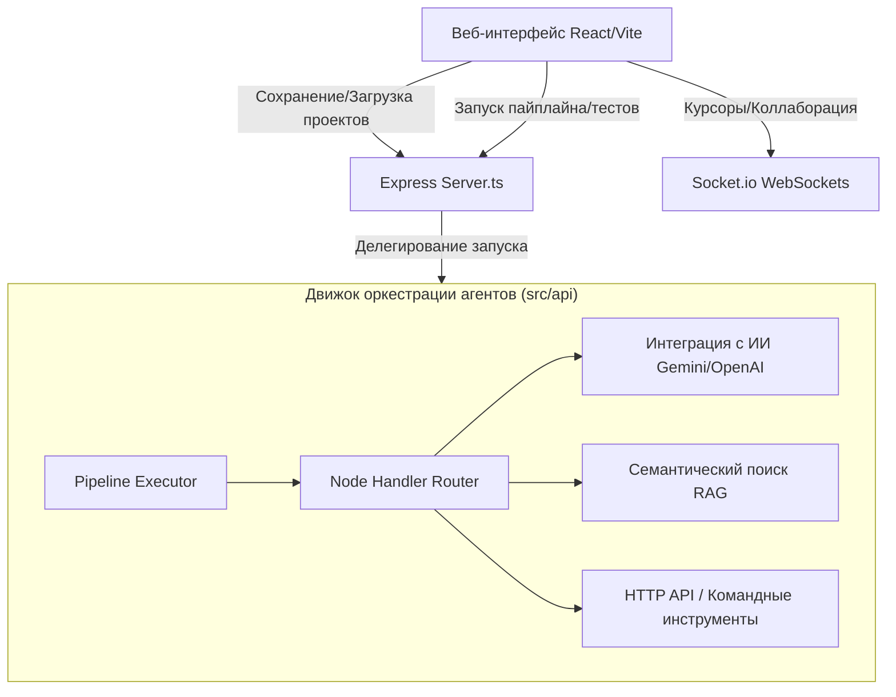

# AgentForge44

Визуальный Low-Code конструктор для проектирования, оркестрации и выполнения мультиагентных AI-систем на базе современных LLM.

---

## 🖼️ Интерактивный веб-интерфейс консоли

```text
┌────────────────────────────────────────────────────────────────────────┐
│  AgentForge Console                                 [Run] [Save] [Share]│
├────────────────────────────────────────────────────────────────────────┤
│  ┌───────────────┐        ┌───────────────┐        ┌───────────────┐   │
│  │  Input Node   ├───────►│  Prompt Node  ├───────►│  Gemini Node  │   │
│  │  Variables    │        │  Templates    │        │  Reasoning    │   │
│  └───────────────┘        └───────────────┘        └───────┬───────┘   │
│                                                            │           │
│                                                            ▼           │
│  ┌───────────────┐        ┌───────────────┐        ┌───────────────┐   │
│  │ Output Node   │◄───────┤  Trace Audit  │◄───────┤ Critic Node   │   │
│  │ Payload Out   │ (Retry)│  Execution    │        │ self-correct  │   │
│  └───────────────┘        └───────────────┘        └───────────────┘   │
└────────────────────────────────────────────────────────────────────────┘
```

---

## ✨ Возможности платформы

- 🎨 **Интуитивный Drag-and-Drop интерфейс** — проектируйте сложные сценарии работы агентов визуально с мгновенным моделированием связей.
- 🤖 **Поддержка ведущих ИИ-провайдеров** — из коробки доступны расширенные интеграции с Google Gemini, OpenAI, Anthropic, а также локальный Ollama.
- 🔄 **Интегрированная база знаний RAG** — индексация, семантический поиск по текстовым файлам и автоматическая доставка релевантного контекста.
- 🎯 **Условная маршрутизация и вызов внешних инструментов** — использование Router и Tool нод для выполнения сетевых запросов и управления логикой.
- 👥 **Совместная работа в реальном времени (Real-time Collaboration)** — синхронное редактирование проекта с индикацией положения курсоров коллег.
- 📊 **Мониторинг ресурсов и затрат** — наглядные графики потребления токенов (Prompt/Response) и автоматический подсчёт финансового расхода.
- 🕰 **История версий (Git-like Backups)** — создание чекпоинтов, просмотр визуального диффа изменений и мгновенный откат к стабильным версиям.
- 🚀 **One-Click Cloud Hover Deploy** — публикация ваших потоков как готовых к продакшену веб-серверов REST API на Vercel, Railway или Fly.io.

---

## ⚡ Быстрый старт

### 🐳 Запуск через Docker (Рекомендуемый способ)

Для развертывания решения в полностью изолированном окружении:

1. Соберите и запустите контейнеры:
   ```bash
   docker-compose up --build
   ```
2. Откройте интерфейс в браузере: **[http://localhost:3000](http://localhost:3000)**

### 🖥️ Локальная разработка (Bare-metal)

Для запуска в режиме разработчика с поддержкой горячей перезагрузки изменений:

1. Установите все зависимости npm:
   ```bash
   npm install
   ```
2. Подготовьте конфигурационный файл `.env`:
   ```bash
   cp .env.example .env
   ```
3. Запустите сервер разработки:
   ```bash
   npm run dev
   ```
4. Откройте локальный порт: **[http://localhost:3000](http://localhost:3000)**

---

## 📁 Архитектура и структура проекта

Для максимальной производительности, простоты развертывания и чистоты кодовой базы проект спроектирован в виде единого компактного full-stack монолита:



### Структура директорий

```text
AgentForge44/
├── src/                # Веб-консоль React/Vite (Клиентская часть)
│   ├── api/            # Логика клиента (интеграция с LLM, контекст, стримы)
│   ├── components/     # Интерактивные визуальные компоненты и диалоги настроек
│   ├── hooks/          # Реализация коллаборации, совместного рисования и хуков
│   ├── tests/          # Модульные и интеграционные автотесты Vitest
│   ├── App.tsx         # Главная панель управления (Dashboard)
│   └── main.tsx        # Точка монтирования React-приложения
├── server.ts           # Full-stack backend Express-сервер
├── Dockerfile          # Скрипт сборки продакшен-контейнеров Docker
├── docker-compose.yml  # Оркестрирование контейнеров
├── tsconfig.json       # Конфигурация компилятора TypeScript
└── vite.config.ts      # Конфигурация сборщика Vite
```

---

## 🧪 Тестирование и верификация

Запустите автоматизированные тесты для проверки целостности логики выполнения узлов:

```bash
# Запуск тестов через Vitest
npm test

# Статический анализ кода на ошибки сборки
npm run lint
```

## 📜 Лицензия

Распространяется по лицензии MIT. Подробнее см. в [LICENSE](./LICENSE).
