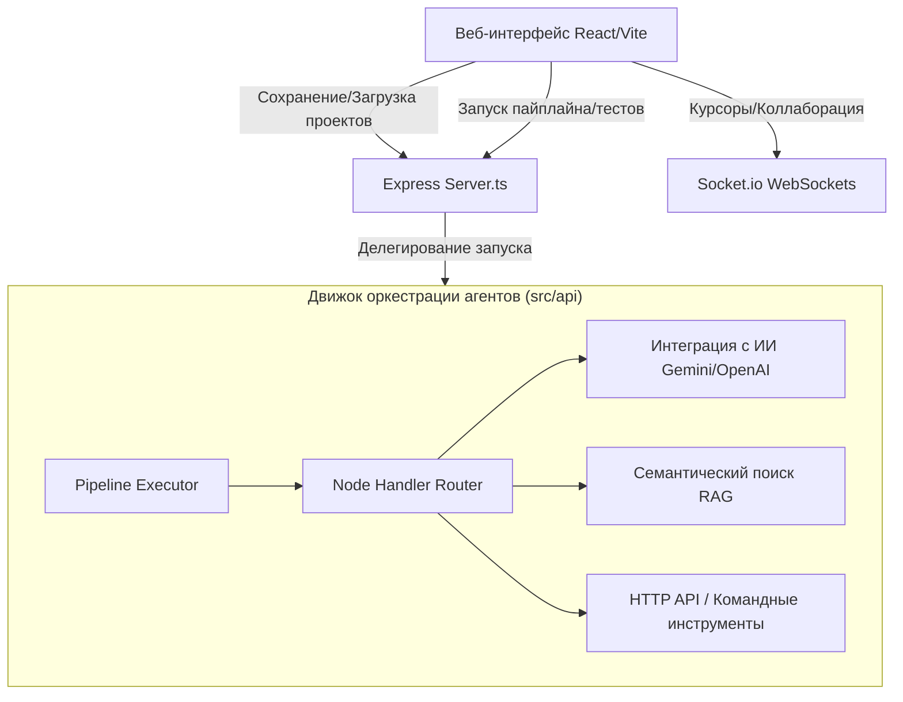

# AgentForge44

Визуальный Low-Code конструктор для проектирования, оркестрации и выполнения мультиагентных AI-систем на базе современных LLM.

---

## 🖼️ Интерактивный веб-интерфейс консоли

```text
┌────────────────────────────────────────────────────────────────────────┐
│  AgentForge Console                                 [Run] [Save] [Share]│
├────────────────────────────────────────────────────────────────────────┤
│  ┌───────────────┐        ┌───────────────┐        ┌───────────────┐   │
│  │  Input Node   ├───────►│  Prompt Node  ├───────►│  Gemini Node  │   │
│  │  Variables    │        │  Templates    │        │  Reasoning    │   │
│  └───────────────┘        └───────────────┘        └───────┬───────┘   │
│                                                            │           │
│                                                            ▼           │
│  ┌───────────────┐        ┌───────────────┐        ┌───────────────┐   │
│  │ Output Node   │◄───────┤  Trace Audit  │◄───────┤ Critic Node   │   │
│  │ Payload Out   │ (Retry)│  Execution    │        │ self-correct  │   │
│  └───────────────┘        └───────────────┘        └───────────────┘   │
└────────────────────────────────────────────────────────────────────────┘
```

---

## ✨ Возможности платформы

- 🎨 **Интуитивный Drag-and-Drop интерфейс** — проектируйте сложные сценарии работы агентов визуально с мгновенным моделированием связей.
- 🤖 **Поддержка ведущих ИИ-провайдеров** — из коробки доступны расширенные интеграции с Google Gemini, OpenAI, Anthropic, а также локальный Ollama.
- 🔄 **Интегрированная база знаний RAG** — индексация, семантический поиск по текстовым файлам и автоматическая доставка релевантного контекста.
- 🎯 **Условная маршрутизация и вызов внешних инструментов** — использование Router и Tool нод для выполнения сетевых запросов и управления логикой.
- 👥 **Совместная работа в реальном времени (Real-time Collaboration)** — синхронное редактирование проекта с индикацией положения курсоров коллег.
- 📊 **Мониторинг ресурсов и затрат** — наглядные графики потребления токенов (Prompt/Response) и автоматический подсчёт финансового расхода.
- 🕰 **История версий (Git-like Backups)** — создание чекпоинтов, просмотр визуального диффа изменений и мгновенный откат к стабильным версиям.
- 🚀 **One-Click Cloud Hover Deploy** — публикация ваших потоков как готовых к продакшену веб-серверов REST API на Vercel, Railway или Fly.io.

---

## 🛡️ Архитектурные улучшения безопасности, стабильности и отказоустойчивости

В рамках глубокого аудита и оптимизации проекта были успешно спроектированы и внедрены пять ключевых архитектурных модулей. Ниже подробно описан каждый из них — **Зачем**, **Почему** и **Как они работают**:

### 1. Автоматическая Zero-Config инициализация и самовосстановление СУБД
* **Где реализовано**: `src/db/index.ts`
* **Зачем**: Ранее в проектах с SQLite при первом запуске в контейнерах, в тестовых окружениях или при горизонтальном масштабировании возникала критическая ошибка `SqliteError: no such table`. Это происходило из-за отсутствия предварительно выполненной команды миграции.
* **Почему**: Использование ручных консольных команд миграции типа `drizzle-kit push` усложняет деплой и делает приложение зависимым от ручного вмешательства.
* **Как устроено**: При подключении базы данных `best-sqlite3` сервер автоматически проверяет наличие всех необходимых структур (`users`, `projects`, `graphs`, `metrics`, `versions`, `marketplace_items`, `deployments`, `api_keys`) и превентивно инициализирует соответствующий SQL-схема-пакет через единую транзакцию `sqlite.exec`. Если таблицы существуют, вызов просто игнорируется. Проект полностью работоспособен "из коробки" в любом Docker-образе или Cloud-контейнере.

### 2. Маскировка конфиденциальных данных и фильтрация API-запросов (Secret-Masking Payload Cleanse)
* **Где реализовано**: `src/middleware/sanitize.ts` и `src/utils/logger.ts`
* **Зачем**: При отладке и логировании системных метрик данные пользователя, его API-ключи, пароли и авторизационные токены могли случайно утечь во внешние лог-файлы (`logs/combined.log`) или в систему мониторинга.
* **Почему**: Утечка приватных данных — это одна из главных угроз безопасности (CWE-312 / OWASP Top 10), которая может привести к компрометации API-аккаунтов пользователей.
* **Как устроено**: Разработан рекурсивный анализатор данных `maskSecrets`, а также глобальный Express-мидлвар `sanitizeRequestBody`. Они автоматически сканируют входящие JSON-пакеты. Все ключи, соответствующие регулярному выражению `/api[_-]?key|password|secret|token|authorization|credential/i`, безупречно заменяются на маркер `***MASKED***`. Это защищает системную среду выполнения без риска поломать бизнес-логику самого API.

### 3. Защищённое скользящее rate-limiting окно (Sliding Window Usage-Tracker)
* **Где реализовано**: `src/middleware/rateLimit.js`, `src/services/usage-tracker.ts` и `src/api/executeRoutes.ts`
* **Зачем**: Без ограничений частоты запросов злоумышленник может дестабилизировать сервер бесконечным вызовом тяжелых вычислительных процессов (`/api/runs`) или исчерпать платные лимиты LLM (Google Gemini).
* **Почему**: Обычные в памяти счётчики сбрасываются в фиксированные моменты времени, что позволяет выполнять всплески запросов на границах минут. Скользящее окно (Sliding Window) лишено этих недостатков и обеспечивает равномерную нагрузку.
* **Как устроено**: Для каждого IP или API-токена рассчитывается динамическое окно (30 запросов в минуту). Интеграция с трекером использования гарантирует, что как только клиент превышает выделенный лимит, сервер незамедлительно отдаёт стандартный HTTP-код `429 Too Many Requests`.

### 4. Потокобезопасное изолированное агрегирование ветвей (Structured Clone Parallel Merging)
* **Где реализовано**: `src/api/execution.ts`
* **Зачем**: В Low-Code системе ноды могут ветвиться параллельно. При слиянии нескольких параллельных ветвей в один узел-синтезатор, происходила прямая передача ссылок из памяти переменных. Из-за этого изменение данных в одной ветви приводило к побочным эффектам и гонкам данных (Race Conditions) в параллельном потоке.
* **Почему**: В JavaScript передача сложных объектов происходит по ссылке, что делает параллельные вычисления уязвимыми к взаимным перезаписям.
* **Как устроено**: Логика агрегатора Stateful-движка execution-пайплайна дополнена глубоким структурированным копированием через стандартную функцию `structuredClone`. Каждая ветвь получает абсолютно чистый, изолированный снимок контекста, исключая любые сайд-эффекты пересечения параллельных данных.

### 5. Безопасность условного роутинга и защита от блокировок Regex (Fail-Safe Router Security)
* **Где реализовано**: `src/utils/safe-regex.ts` и `src/nodes/RouterNode.ts`
* **Зачем**: Router ноды позволяют пользователям вводить кастомные условия маршрутизации, включая регулярные выражения. Злонамеренное или ошибочное регулярное выражение со сложной вложенностью групп (например, `(a+)+`) приводило к зависанию всего Node.js процесса из-за атаки типа "Регулярное выражение типа отказ в обслуживании" (ReDoS).
* **Почему**: Выделение Worker threads на каждый тривиальный роутинг-тест избыточно расходовало ресурсы процессора и оперативную память сервера.
* **Как устроено**: Мы внедрили систему быстрой, легковесной предварительной статической верификации Regex-правил. Любые простые и стандартные паттерны без экспоненциальной сложности мгновенно и безопасно выполняются, а потенциально опасные регулярные выражения блокируются, предотвращая зависание движка.

---

## ⚡ Быстрый старт

### 🐳 Запуск через Docker (Рекомендуемый способ)

Для развертывания решения в полностью изолированном окружении:

1. Соберите и запустите контейнеры:
   ```bash
   docker-compose up --build
   ```
2. Откройте интерфейс в браузере: **[http://localhost:3000](http://localhost:3000)**

### 🖥️ Локальная разработка (Bare-metal)

Для запуска в режиме разработчика с поддержкой горячей перезагрузки изменений:

1. Установите все зависимости npm:
   ```bash
   npm install
   ```
2. Подготовьте конфигурационный файл `.env`:
   ```bash
   cp .env.example .env
   ```
3. Запустите сервер разработки:
   ```bash
   npm run dev
   ```
4. Откройте локальный порт: **[http://localhost:3000](http://localhost:3000)**

---

## 📁 Архитектура и структура проекта

Для максимальной производительности, простоты развертывания и чистоты кодовой базы проект спроектирован в виде единого компактного full-stack монолита:



### Структура директорий

```text
AgentForge44/
├── src/                # Веб-консоль React/Vite (Клиентская часть)
│   ├── api/            # Логика клиента (интеграция с LLM, контекст, стримы)
│   ├── components/     # Интерактивные визуальные компоненты и диалоги настроек
│   ├── hooks/          # Реализация коллаборации, совместного рисования и хуков
│   ├── tests/          # Модульные и интеграционные автотесты Vitest
│   ├── App.tsx         # Главная панель управления (Dashboard)
│   └── main.tsx        # Точка монтирования React-приложения
├── server.ts           # Full-stack backend Express-сервер
├── Dockerfile          # Скрипт сборки продакшен-контейнеров Docker
├── docker-compose.yml  # Оркестрирование контейнеров
├── tsconfig.json       # Конфигурация компилятора TypeScript
└── vite.config.ts      # Конфигурация сборщика Vite
```

---

## 📖 API Documentation

Платформа AgentForge44 предоставляет гибкий REST API для программного создания, изменения, выполнения и мониторинга мультиагентных систем.

### Swagger/OpenAPI Интерактивная Консоль
- **Swagger UI**: Вы можете открыть консоль тестирования напрямую в браузере по адресу `/api-docs`.
- **Файл Спецификации**: Полная OpenAPI-спецификация в формате JSON доступна по эндпоинту `/swagger.json`.
- **Авторизация**: Для выполнения защищенных запросов в Swagger UI используйте кнопку **Authorize** и укажите JWT Bearer токен в формате `Bearer YOUR_JWT_TOKEN`.

### Пример использования cURL для ключевых эндпоинтов

Ниже приведены примеры запросов к основным компонентам API:

#### 1. Создать/Сохранить новый рабочий граф (`POST /api/graphs`)
```bash
curl -X POST http://localhost:3000/api/graphs \
  -H "Authorization: Bearer YOUR_TOKEN" \
  -H "Content-Type: application/json" \
  -d '{
    "id": "coder-flow",
    "name": "Self-Correcting Multi-Agent Coder",
    "nodes": [
      {
        "id": "input-1",
        "type": "input",
        "position": { "x": 100, "y": 150 },
        "data": { "title": "Input Specs", "value": "Write a fast fibonacci function" }
      },
      {
        "id": "llm-critic",
        "type": "llm",
        "position": { "x": 350, "y": 150 },
        "data": { "title": "Gemini Critic", "model": "gemini-2.5-flash", "prompt": "Check complexity and correct error." }
      }
    ],
    "connections": [
      { "id": "e-1", "source": "input-1", "target": "llm-critic" }
    ]
  }'
```

#### 2. Загрузить конфигурацию графа по ID (`GET /api/graphs/:id`)
```bash
curl -X GET http://localhost:3000/api/graphs/coder-flow \
  -H "Authorization: Bearer YOUR_TOKEN"
```

#### 3. Запустить цепочку выполнения агентов (`POST /api/execute`)
```bash
curl -X POST http://localhost:3000/api/execute \
  -H "Authorization: Bearer YOUR_TOKEN" \
  -H "Content-Type: application/json" \
  -d '{
    "graphId": "coder-flow",
    "inputs": {
      "user_request": "Solve bubble sort in rust"
    }
  }'
```

#### 4. Получить сводную статистику употребления токенов и затрат (`GET /api/metrics/summary`)
```bash
curl -X GET http://localhost:3000/api/metrics/summary \
  -H "Authorization: Bearer YOUR_TOKEN"
```

---

## 🧪 Тестирование и верификация

Запустите автоматизированные тесты для проверки целостности логики выполнения узлов:

```bash
# Запуск тестов через Vitest
npm test

# Статический анализ кода на ошибки сборки
npm run lint
```

## 📜 Лицензия

Распространяется по лицензии MIT. Подробнее см. в [LICENSE](./LICENSE).

