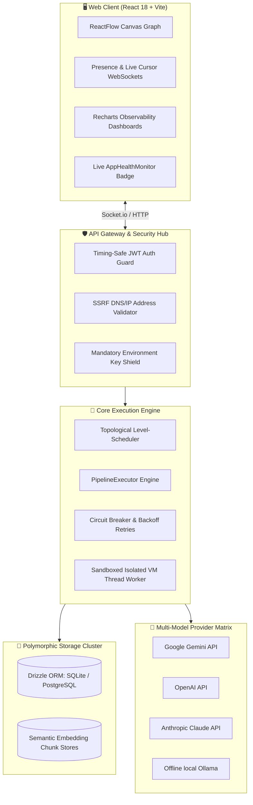

<div align="center">


# 🌌 KostromAi44
### Production-Grade Visual Low-Code Orchestrator for Resilient, Self-Correcting Multi-Agent AI Networks

**Design complex reasoning topologies on an interactive vector canvas. Execute with parallel topology scheduling, self-healing validation loops, and multi-user sync. Serve it instantly as a robust, secure REST API.**

<p>
  <b>🇺🇸 English</b> &nbsp;|&nbsp;
  <a href="./README.ru.md">🇷🇺 Русский</a> &nbsp;|&nbsp;
  <a href="./README.zh.md">🇨🇳 中文</a>
</p>

<p>


</p>

---

### "Moving Multi-Agent LLM Orchestration from Unpredictable Scripts to Resilient, Observable Topologies."

</div>

---

## 🎨 Premium X-Style UI/UX Redesign & Aesthetic Philosophy

The entire platform interface has undergone a professional, FAANG-caliber visual and architectural redesign focusing on minimalist precision:
- **"X" (Twitter) Dark Mode Aesthetic**: Utilizing ultra-high contrast pitch-black backgrounds (`bg-black`) and matte zinc accents to eliminate distracting gradients and visual clutter. All focus is placed purely on your multi-agent architecture.
- **Modern Volumetric Depth**: Implementing soft Glassmorphism textures, subtle hairline borders (`border-neutral-900`) instead of heavy boxes, and ambient multi-layered shadows (`shadow-volumetric`) to give components a tactile, floating presence.
- **Bold Typography & Hierarchy**: Incorporating the premium geometric `Space Grotesk` font for prominent display headings, paired with `JetBrains Mono` for developer metrics, step parameters, and logs.
- **Progressive Disclosure**: Reducing distraction by hiding unnecessary technical telemetry in margins, keeping the layout perfectly breathable and elegant.

---

## 🗺️ Table of Contents

- [🌌 Architectural Vision](#-architectural-vision)
- [💎 Strategic Pillars & Strengths](#-strategic-pillars--strengths)
- [🧩 Advanced Node Directory](#-advanced-node-directory)
- [🏗️ System Topology Flow](#%EF%B8%8F-system-topology-flow)
- [🛠️ Technical Stack & Modules](#%EF%B8%8F-technical-stack--modules)
- [🚦 Quick Start & Setup Wizards](#-quick-start--setup-wizards)
- [🔒 Zero-Trust Security Compliance](#-zero-trust-security-compliance)
- [🔌 REST API & WebSocket Specifications](#-rest-api--websocket-specifications)
- [📊 Telemetry & Health Monitoring](#-telemetry--health-monitoring)
- [🧪 Quality Assurance & Verification](#-quality-assurance--verification)
- [📦 Production Deployment](#-production-deployment)
- [📜 License & Contribution](#-license--contribution)

---

## 🌟 Architectural Vision

Most LLM orchestration systems suffer from three fundamental flaws: **silent output degradation**, **fragile API integration**, and **zero production visibility**. 

**KostromAi44** addresses these limitations by introducing a robust visual graph architecture designed for enterprise-ready applications. Pipelines are modeled as strict topological directed acyclic graphs (DAGs) capable of dynamic execution rewinds (Self-Correction Loops), real-time human-in-the-loop chat gates, and multi-user visual synchronization. 

---

## 💎 Strategic Pillars & Strengths

### 1. 🎨 Visual Multi-Agent Canvas (ReactFlow v11 Core)
*   **Intuitive Drag-and-Drop**: Built using a high-performance vector canvas supporting grid snapping, multi-selection, connection line routing, and real-time execution node highlights.
*   **Micro-Interactive Controls**: View active node execution states, intermediate token counts, and input/output payload structures with rich, hover-triggered telemetry directly on the canvas.

### 2. ⚡ Topological Parallel Level-Scheduler
*   **Concurrent Execution Branches**: The system analyzes connection pathways to find independent parallel branches, running them concurrently inside Node worker thread Pools to maximize performance.
*   **Stateful Pipeline Executor**: Handles runtime variables cleanly, feeding the output of parent nodes into child templates using robust, secure sanitizers.

### 3. 🔄 Self-Correction & Auto-Healing Loops
*   **AI-Powered Quality Assurance**: `Reviewer` nodes analyze the outputs of upstream LLM generators against structured metrics. If evaluation thresholds are missed, the system *automatically rewinds* the graph state to a specified parent node, passing the review feedback to self-correct the output.
*   **Infinite Loop Preventer**: Enforces configurable execution retry budgets to prevent cascading API cost inflation.

### 4. 🔒 Zero-Trust Environment Shield
*   **Mandatory Cryptographic Verification**: Incorporates an active security compliance engine (`EnvironmentSecurityModal`) that verifies host configuration. If vital parameters (`JWT_SECRET`, `ENCRYPTION_MASTER_KEY`) are missing or insecure, the engine prompts the user, offering a one-click auto-generation of 256-bit cryptographically secure high-entropy hashes.
*   **AES-256 Symmetric Encryption**: Sensitive external credentials (e.g., Anthropic, OpenAI, Gemini tokens) are stored symmetrically encrypted in the database, with keys fully masked before payload logs are written.
*   **Hardened Sandbox Thread Execution**: Custom `Tool / Code` nodes execute in strictly isolated, sandboxed CPU/Memory threads completely detached from the host filesystem.

### 5. 📚 Multi-Document RAG & Interactive 3D Embedding Explorer
*   **Multi-Format Binary Ingestion**: Supports high-fidelity text, markdown, and native binary parsed **PDF (.pdf) & Microsoft Word (.docx)** files. The backend ingestion engine processes files and indexes them into semantic vector chunks under-the-hood.
*   **Chunk Cataloging & Deep Text Search**: Features a dedicated visual catalog where developers can search semantic databases, highlighted by exact chunk text previews.
*   **3D Vector Visualizer**: Graphically map embedded document clusters and semantic relationships in a fully interactive 3D WebGL coordinate space.

### 6. 👥 Real-Time Collaboration Presence Hub
*   **Multi-Cursor Synchronization**: Connect multiple developers simultaneously using high-efficiency Socket.io WebSockets. Cursors, active selection boundaries, and presence cards synchronize instantly.
*   **Dynamic Resource Locking**: Protects work-in-progress. Once a developer begins modifying or configuring a node, the resource is locked to prevent overwriting.

### 7. ⏱️ Git-Style Time-Travel & Version Control
*   **Linear Revision Histories**: Automatically logs canvas structural states.
*   **Visual Diff Viewer**: Compares current and historic graphs with color-coded side-by-side indicators showing added nodes, deleted connections, and adjusted configurations.

### 8. 📊 Integrated App Health & Service Topology Monitors
*   **Live Microservice Status Indicator**: Head-up display (`AppHealthMonitor`) checking system microservice health (SQLite/PostgreSQL databases, Redis cache, and API Gateways) every 15 seconds. Tracks latency in milliseconds and exposes degradations transparently.
*   **Telemetry Infrastructure**: Out-of-the-box support for OpenTelemetry spans and Prometheus metric scraping endpoints (`GET /metrics`).

### 9. 🔌 Dynamic Model Context Protocol (MCP) Orchestration
*   **Adaptive Tool Provisioning**: Register and manage local or remote Model Context Protocol (MCP) servers (e.g. SQLite database systems, system filesystems, Puppeteer automation scripts) with dynamic shell execution arguments directly from the Live Collaboration Hub.
*   **Secured Protocol Boundaries**: Synchronizes tool schemas to active canvas agents instantly, allowing them to dynamically run allowed operating system commands under strict policy validation layers.

### 10. ⏱️ Micro-Step Debugger On-the-Fly State Modification
*   **Dynamic Variables Injection**: Halt or inspect executing snapshots inside the Visual Time-Travel Debugger to modify or override intermediate input and output state fields on-the-fly.
*   **State Propagation Engine**: Edits instantly propagate to all subsequent execution memory frames, updating dry run canvas nodes to simulate corrected pipeline behaviors without full system restarts.

### 11. 🔔 Intercepting Global Toast Notifications System
*   **Fetch Middleware Guards**: Intercepts outgoing client HTTP fetch calls to automatically identify and catch server-side crashes, API connection drops, and pipeline runner errors.
*   **Real-time Multilingual Feedback**: Automatically fires eye-catching animated visual overlays mapped in selected user languages (English, Russian, or Chinese), completely eliminating silent failures.

---

## 🧩 Advanced Node Directory

| Node Component | Icon | Primary Objective | Advanced Features |
| :--- | :---: | :--- | :--- |
| **Input Node** | 📥 | Ingest initial JSON payloads and system arguments. | Type assertion, default fallbacks, schema parsing. |
| **Prompt Template** | 📝 | Build modular prompt chains using mustache template bindings. | Auto-parsing of required parent variables. |
| **LLM Engine** | 🤖 | Dispatch prompts to AI models with fine-grained temperature limits. | Unified API supporting **Gemini, OpenAI, Claude, and Ollama**. |
| **Reviewer Node** | 🔍 | Systematically score AI output formats against custom regex or schemas. | Conditional rewind triggers and feedback routing. |
| **Router Node** | 🔀 | Evaluate outputs and conditionally branch execution. | Safe evaluation, regex matching, and script evaluation. |
| **RAG / Knowledge** | 📖 | Ingest text files and fetch relevant semantic context. | Similarity threshold filters, chunk size controls. |
| **Tool / Code** | 💻 | Run custom JavaScript business logic during execution. | Strict CPU/Memory isolated thread boundaries. |
| **Multi-Agent Debate** | 🎭 | Run structural consensus debates between opposing AI personas. | Arbitrator node synthesis, multi-turn argument loops. |
| **Human Validation** | 💬 | Halt pipeline execution to await human approval. | Direct chat gate with paused nodes to modify properties. |
| **Prompt Optimizer** | ✨ | Polish prompts dynamically to match model-specific sweet-spots. | Auto-injection of chain-of-thought instructions. |
| **Output Node** | 📤 | Consolidate, compile, and return the final API payload response. | Structure validation, payload cleanup, and logging. |

---

## 🏗️ System Topology Flow



---

## 🛠️ Technical Stack & Modules

*   **Frontend**: React 18+, Vite (Hot Module Replacement disabled by control plane for deterministic visual iteration), Tailwind CSS v4, Framer Motion, ReactFlow v11, Lucide Icons, Recharts, 3D WebGL Canvas.
*   **Backend**: Node.js, Express, TSX compilation runner, Winston logging orchestrator, Socket.io.
*   **Database**: Drizzle ORM, SQLite for zero-config setups, PostgreSQL client pool for heavy production scales.
*   **Observability**: OpenTelemetry Tracer API, `prom-client` (Prometheus metric collectors).
*   **Security Stack**: PBKDF2-SHA512 password hash keys, AES-256-GCM secret tokens, SSRF block guards.

---

## 🚦 Quick Start & Setup Wizards

### 🚀 Initial Onboarding Wizard
When launching the application for the first time, you will be greeted by the **First Launch Wizard**. 
1. Select your interface language (**English, Russian, or Chinese**).
2. Configure your credentials.
3. Keep the **Generate Workspace Config Files** toggle active (Recommended) to automatically pre-populate your environment (`.env` and `workspace_config.json`) with sandbox tokens to instantly explore every feature without complex onboarding.

### 🖥️ Local Installation
Ensure you have **Node.js v18+** installed:

```bash
# 1. Clone the repository
git clone https://github.com/igraybalalayka/KostromAi44.git
cd KostromAi44

# 2. Install dependencies
npm install

# 3. Spin up full-stack servers
npm run dev
```
Open **[http://localhost:3000](http://localhost:3000)** inside your browser.

### 🐳 Run using Docker Compose
For a fully containerized deployment including active observability endpoints:

```bash
docker-compose up --build
```

---

## 🔒 Zero-Trust Security Compliance

KostromAi44 is fortified against common enterprise vulnerability vectors:

1.  **SSRF Protection**: Outgoing HTTP connections from nodes are intercepted by a validation layer, blocking attempts to connect to local/private network ranges (e.g., `127.0.0.1`, `10.0.0.0/8`, `192.168.0.0/16`).
2.  **Timing-Safe Key Comparison**: Authentications use constant-time buffer comparisons (`crypto.timingSafeEqual`) to prevent side-channel timing analysis attacks.
3.  **Log Masking Engine**: Payloads are swept before persistent storage, masking keys, tokens, and authorization parameters with high-entropy placeholders.
4.  **Token Revocation**: Enforces JWT Token Revocation via JTI ID tracking in Redis caches, ensuring session endings are immediately propagated.

---

## 🔌 REST API & WebSocket Specifications

### 1. Ingest Execution Pipeline (`POST /api/execute`)
Triggers execution of a mapped topological graph by its unique identifier.

```bash
curl -X POST http://localhost:3000/api/execute \
  -H "Content-Type: application/json" \
  -H "Authorization: Bearer <JWT_TOKEN>" \
  -d '{
    "graphId": "translation-validator-v2",
    "inputs": {
      "input_text": "Greetings visual AI orchestrator team!"
    }
  }'
```

### 2. Live Collaboration WebSockets (Socket.io)
Client connections join rooms corresponding to specific active graph IDs:

*   `presence:join` (`{ graphId, user }`): Announces user presence on a graph.
*   `cursor:move` (`{ graphId, x, y }`): Propagates real-time cursor positions.
*   `node:lock` (`{ graphId, nodeId }`): Prevents write collisions on a component.

---

## 📊 Telemetry & Health Monitoring

### App Health Monitor
A key strength of this architecture is the active head-up status display located in the top-right corner of the application navbar:
*   **Green (ONLINE)**: All sub-components (database pool, cache layers, API endpoints) are healthy and processing payloads with sub-10ms latencies.
*   **Yellow (DEGRADED)**: Redis cache is unresponsive, but the system remains fully functional via local database fallbacks.
*   **Red (OFFLINE)**: Server gateway is unreachable.

### Metrics & Traces
*   **Scraper Route**: Prometheus tracks active connection pools, token consumption rates, and API call counts via `/metrics`.
*   **OTel Tracing**: Deeply integrated spans visualize pipeline bottlenecks during execution.

---

## 🧪 Quality Assurance & Verification

The suite incorporates rigid unit, integration, and end-to-end regression controls to enforce architectural compliance:

```bash
npm run test           # Executes full Vitest unit & integration suites
npm run test:coverage  # Generates thorough statement/branch coverage reports
npm run test:e2e       # Runs Playwright browser visual regression tests
npm run lint           # Runs rigid ESLint syntax and import checking
```

---

## 📦 Production Deployment

The codebase is ready for production and complies with cloud deployment standards:

### Google Cloud Run (Recommended)
1. Provide environment variables in your Google Cloud Console.
2. Build and push the production image:
```bash
gcloud builds submit --tag gcr.io/your-project-id/kostromai44
gcloud run deploy kostromai44 --image gcr.io/your-project-id/kostromai44 --platform managed --port 3000
```

### Kubernetes Configuration
See `/kubernetes` folder for fully configured deployment manifests including Ingress controllers, Horizontal Pod Autoscalers (HPAs), and Persistent Volume Claims (PVCs).

---

## 📜 License & Contribution

This project is licensed under the terms of the **MIT License**. For complete terms, see [LICENSE](./LICENSE).

Contributions are welcome! Please read our [CONTRIBUTING.md](./CONTRIBUTING.md) and [DEVELOPMENT.md](./DEVELOPMENT.md) guidelines before opening a pull request.

---

<div align="center">

**Designed with precision, engineered for resilience. Powered by the visual AI developer community.**

</div>
