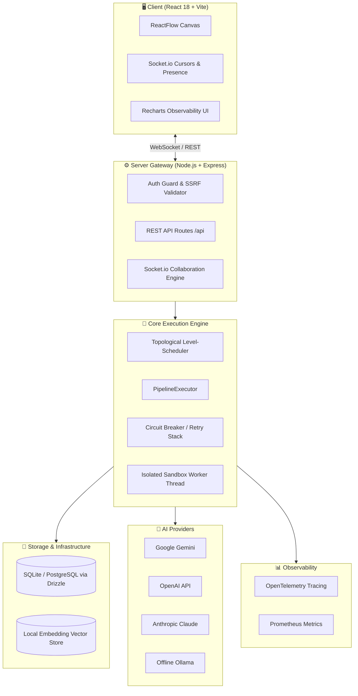

<div align="center">


# 🌌 AgentForge44

### Visual, low-code orchestrator for resilient, self-correcting multi-agent LLM workflows

**Design complex reasoning on a canvas. Serve it as a robust API. Observe everything in real-time.**

<p>
  <b>🇺🇸 English</b> &nbsp;|&nbsp;
  <a href="./README.ru.md">🇷🇺 Русский</a> &nbsp;|&nbsp;
  <a href="./README.zh.md">🇨🇳 中文</a>
</p>

<p>


</p>

</div>

---

## ✨ Overview

**AgentForge44** is a production-grade, low-code platform for building, testing, evaluating, and deploying complex multi-agent AI workflows. Featuring an interactive vector canvas, it enables developers to wire up chains of LLM reasoning, conditional routers, semantic knowledge retrievers, and self-correcting evaluation loops, serving the pipeline as an enterprise-resilient REST API.

It unifies modern LLM providers (**Google Gemini, OpenAI, Anthropic Claude, and offline Ollama**), leverages a high-availability execution queue, and enforces first-class observability and security out of the box.

---

## 🗺️ Table of Contents

- [Features](#-features)
- [Node Types](#-node-types)
- [Architecture](#-architecture)
- [Tech Stack](#-tech-stack)
- [Quick Start](#-quick-start)
- [Configuration](#-configuration)
- [API Usage](#-api-usage)
- [Observability](#-observability)
- [Security](#-security)
- [Testing](#-testing)
- [Deployment](#-deployment)
- [License](#-license)

---

## 🚀 Features

| Feature | Description |
|---|---|
| 🎨 **Visual Canvas** | Drag-and-drop node graph builder (ReactFlow) with snap-to-grid alignment. |
| 🤖 **Multi-Provider LLM** | Unified SDK for Gemini, OpenAI, Claude, and local Ollama. |
| 🔄 **Self-Correction Loops** | Reviewer nodes evaluate outputs and conditionally rewind execution until quality metrics pass. |
| 🗃️ **Polymorphic DB** | Seamlessly switch between SQLite for local testing and PostgreSQL for production. |
| ⚡ **Parallel Execution** | High-performance topologic scheduler runs independent execution branches concurrently. |
| 📦 **Auto-Healing Schema** | Migrator boots transactionally, initializing or repairing schemas on the fly. |
| 🛡️ **Security Fortress** | Built-in SSRF guards, timing-safe PBKDF2-SHA512 hashing, AES-256-GCM secret masking. |
| 🔌 **Resilience Stack** | Exponential backoff retries with Jitter, stateful circuit breakers, and offline LLM fallbacks. |
| 📊 **3D RAG Viewer** | Visualize embedding clusters and similarity connections in a fully interactive 3D space. |
| 👥 **Real-Time Collaboration** | Synchronized multi-user presence, cursors, and state locks over Socket.io WebSockets. |
| 🔍 **Observability Engine** | Deeply integrated OpenTelemetry traces and Prometheus metric counters. |
| 🕑 **Time-Travel Debugger** | Git-style graph revision histories with interactive diff viewers. |

---

## 🧩 Node Types

| Node Type | Purpose / Description |
|---|---|
| `Input` | Gathers initial payload variables and runtime parameters. |
| `Prompt` | Constructs parameterized prompts using Handlebars template syntax. |
| `LLM Engine` | Dispatches prompts to chosen models with configurable temperature, token caps, and system instructions. |
| `Reviewer` | Critiques upstream AI outputs and routes the pipeline backward if quality criteria fail. |
| `Router` | Routes execution down specific branches based on pattern matching or condition scripts. |
| `RAG / Knowledge` | Embedded semantic retriever serving chunked document vector lookups. |
| `Tool / Code` | Safely executes sandboxed custom JS code inside secure isolated threads. |
| `Output` | Consolidates and returns the final structured pipeline response. |

---

## 🏗️ Architecture



---

## 🛠️ Tech Stack

- **Frontend**: React 18+, Vite, Tailwind CSS, Framer Motion, ReactFlow, Lucide Icons, Recharts
- **Backend**: Node.js, Express, TSX, Winston, Socket.io
- **Database**: Drizzle ORM, SQLite, PostgreSQL
- **AI Integrations**: `@google/genai`, `openai`, `@anthropic-ai/sdk`, `ollama`
- **Observability**: OpenTelemetry SDK + Tracing API, `prom-client` (Prometheus)
- **Security**: PBKDF2-SHA512 password hashing, AES-256-GCM encryption, SSRF protection module

---

## ⚡ Quick Start

> 📖 **Important Note for Getting Started:** We have prepared a comprehensive step-by-step guide on how to obtain API keys (Google Gemini, OpenAI, Claude, Ollama, Pinecone, Tavily), generate required cryptographic keys, and launch the platform. Read it here: **[DETAILED KEY CONFIGURATION & SETUP GUIDE](./INSTRUCTIONS.md)**.

### 🐳 Method A: Docker Compose (Recommended)
Make sure you have Docker installed on your host system:
```bash
# 1. Clone the project
git clone https://github.com/igraybalalayka/AgentForge44.git
cd AgentForge44

# 2. Start the multi-container environment
docker-compose up --build
```
Access the application at **[http://localhost:3000](http://localhost:3000)**.

### 🖥️ Method B: Local Environment
Ensure you are using **Node.js v18** or newer:
```bash
# 1. Install dependencies
npm install

# 2. Bootstrap environment variables
cp .env.example .env

# Generate secure secrets (required for server boot)
echo "JWT_SECRET=$(openssl rand -base64 48)" >> .env
echo "ENCRYPTION_MASTER_KEY=$(openssl rand -base64 48)" >> .env

# 3. Spin up full-stack dev servers
npm run dev
```
Open **[http://localhost:3000](http://localhost:3000)** inside your browser.

> 💡 **Demo Sandbox Mode:** You can set `GEMINI_API_KEY=sandbox_free_test_gemini` to experience the full visual canvas with high-fidelity simulated model outputs without an active subscription key.

---

## ⚙️ Configuration

Key environment variables available (defined in [`.env.example`](./.env.example)):

| Variable | Required | Description |
|---|:---:|---|
| `JWT_SECRET` | Yes | Token signing secret key (must be at least 32 characters long). |
| `ENCRYPTION_MASTER_KEY`| Yes | AES-256-GCM symmetric key used to encrypt stored credentials. |
| `GEMINI_API_KEY` | No | Google AI Studio access key (or `sandbox_free_test_gemini`). |
| `DB_TYPE` | No | Target database engine: `sqlite` (default) or `postgres`. |
| `DATABASE_URL` | No | Connection string for PostgreSQL (applicable when DB_TYPE=postgres). |
| `SENTRY_DSN` | No | Active Sentry error logging telemetry endpoint. |

---

## 🔌 API Usage

Detailed OpenAPI specifications are available at **`GET /api-docs`**.

### 1. User Registration (`POST /api/auth/register`)
```bash
curl -X POST http://localhost:3000/api/auth/register \
  -H "Content-Type: application/json" \
  -d '{
    "email": "developer@agentforge.ai",
    "password": "SecurePassword123!",
    "role": "editor"
  }'
```

### 2. User Login (`POST /api/auth/login`)
```bash
curl -X POST http://localhost:3000/api/auth/login \
  -H "Content-Type: application/json" \
  -d '{
    "email": "developer@agentforge.ai",
    "password": "SecurePassword123!"
  }'
```

### 3. Save or Update Workflow Graph (`POST /api/graphs`)
```bash
curl -X POST http://localhost:3000/api/graphs \
  -H "Content-Type: application/json" \
  -H "Authorization: Bearer <JWT_TOKEN>" \
  -d '{
    "id": "translation-validator",
    "name": "Localization Evaluator",
    "nodes": [
      {
        "id": "prompt-input",
        "type": "prompt",
        "fields": { "text": "Translate and polish: {{input_text}}" }
      }
    ],
    "connections": []
  }'
```

### 4. Execute Orchestrated Pipeline (`POST /api/execute`)
```bash
curl -X POST http://localhost:3000/api/execute \
  -H "Content-Type: application/json" \
  -H "Authorization: Bearer <JWT_TOKEN>" \
  -d '{
    "graphId": "translation-validator",
    "inputs": {
      "input_text": "Good morning, developers!"
    }
  }'
```

### 5. User Logout & Session Revocation (`POST /api/auth/logout`)
```bash
curl -X POST http://localhost:3000/api/auth/logout \
  -H "Authorization: Bearer <JWT_TOKEN>"
```

---

## 📊 Observability

- **Metrics Scraper**: Prometheus compliant endpoint served at `GET /metrics` tracking total HTTP calls, latencies, LLM call counts, and token usage rates.
- **OTel Distributed Traces**: Comprehensive trace context propagation across the network boundary, visualizing step-by-step latency bottlenecks inside Zipkin or Jaeger.
- **Graceful Shutdown**: Core services handle `SIGTERM` / `SIGINT` signals correctly, flushing internal trace spans and closing DB client pool threads safely.

---

## 🛡️ Security Architecture

1. **SSRF Guard**: Pre-validates outgoing request URLs, explicitly blocking private IP ranges (`127.0.0.1`, `10.0.0.0/8`, `192.168.0.0/16`) and preventing loopback scans.
2. **Secret Cleanser**: Recursively scrubs payloads before saving execution logs, masking sensitive keys (e.g. `api_key`, `jwt_token`) into secure placeholder flags.
3. **ReDoS Defense**: Hardened regular expression validators block catastrophic backtracking scenarios inside Router rule sets.
4. **Isolated VM Sandbox**: External scripts inside Tool nodes are executed in strict CPU/Memory isolated thread boundaries, completely detached from the host filesystem.
5. **Timing-Safe Key Auditing**: Utilizes constant-time buffer comparisons (`crypto.timingSafeEqual`) for master API-key checks to completely mitigate side-channel timing analysis attacks.
6. **Strict Role Priority Guard**: Hardened Express hierarchical role verification, enforcing rigid permission hierarchies and preventing role-escalation bypasses.
7. **Stateless Token Revocation (JTI Blacklist)**: Standard JWT token handling with JTI (JWT ID) checking against a centralized Redis cache blacklist, ensuring instantaneous token revocation on user logout.
8. **Stateless Cloud-Native Projects**: Decoupled filesystem directory write blockages, making the core database the absolute single source of truth for seamless elastic scaling.

---

## 🧪 Testing

```bash
npm run test           # Executes Vitest unit & integration suites
npm run test:coverage  # Generates testing coverage reports
npm run test:e2e       # Runs Playwright browser automation
npm run lint           # Static code analysis and ESLint verification
```

---

## 📜 License

This project is licensed under the terms of the **MIT License**. For details, see [LICENSE](./LICENSE).

<div align="center">

**Crafted with ❤️ for the resilient Visual AI community.**

</div>
