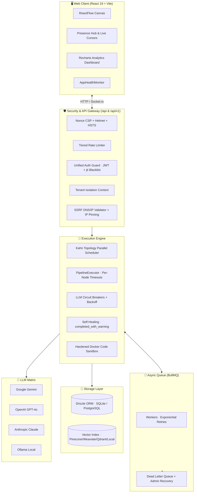

<div align="center">

# 🌌 KostromAi44

### **Production-Grade Visual Low-Code Orchestrator for Resilient, Self-Correcting Multi-Agent AI Networks**

[](https://github.com/ppiiyo/AgentForge44/actions)
[](https://nodejs.org/)
[](https://www.typescriptlang.org/)
[](https://react.dev/)
[](https://www.docker.com/)
[](LICENSE)

[**English**](README.md) | [**Русский**](README.ru.md) | [**简体中文**](README.zh.md)

</div>

---

## 📖 Overview

**KostromAi44** is an enterprise-grade visual AI orchestration framework that empowers developers to design, simulate, debug, and deploy complex autonomous multi-agent topologies. Built on top of Kahn's topological scheduler, Docker code sandboxing, live multi-user collaboration via Socket.io, and self-healing evaluation loops, KostromAi44 bridges the gap between drag-and-drop workflow builders and mission-critical production backend infrastructure.

---

## ✨ Key Architectural Highlights

| Feature | Technical Implementation | Value Proposition |
| :--- | :--- | :--- |
| 🚀 **Topological Parallel Scheduler** | Kahn's DAG level-scheduling algorithm with promise-pooling concurrency controls | Executes independent agent branches in parallel with zero deadlocks |
| 🔄 **Self-Healing Telemetry** | Automated LLM repair routines with honest state marking (`completed_with_warning`) | Prevents silent failures while attempting automated node auto-recovery |
| 🛡️ **Hardened Code Sandbox** | Non-root Docker containers with `--cap-drop ALL`, `--network none`, `--read-only`, and 64MB RAM limits | Safely executes untrusted Python/JS user code without host compromise |
| 👥 **Real-Time Collaboration** | Room-scoped Socket.io presence hub with vector cursor broadcasting and state lock | Enables multi-engineer co-design of complex AI DAG topologies |
| 📚 **Multi-Format RAG Pipeline** | PDF/DOCX/MD chunking parser coupled with Pinecone, Weaviate, Qdrant, or Local Stores | Contextualizes model reasoning with hybrid semantic vector search |
| 🕑 **Time-Travel Replay Engine** | Immutable state ledger tracking node-level variable mutations | Step backwards and forwards through pipeline execution snapshots |
| 🔒 **Enterprise Security Architecture** | Nonce-based CSP, SSRF IP-pinning validator, JWT with Redis `jti` revocation list, and AES-256 GCM encryption at rest | Complies with strict security and privacy standards |

---

## 🏗️ System Architecture


```mermaid
flowchart TD
    subgraph Client["🖥️ Web Client (React 19 + Vite)"]
        Canvas[ReactFlow Canvas]
        Presence[Presence Hub & Live Cursors]
        Obs[Recharts Analytics Dashboard]
        Health[AppHealthMonitor]
    end

    subgraph Gateway["🛡️ Security & API Gateway (/api & /api/v1)"]
        CSP[Nonce CSP + Helmet + HSTS]
        RL[Tiered Rate Limiter]
        Guard[Unified Auth Guard · JWT + jti Blacklist]
        Tenant[Tenant Isolation Context]
        SSRF[SSRF DNS/IP Validator + IP Pinning]
    end

    subgraph Engine["🧠 Execution Engine"]
        Sched[Kahn Topology Parallel Scheduler]
        Exec[PipelineExecutor · Per-Node Timeouts]
        CB[LLM Circuit Breakers + Backoff]
        Heal[Self-Healing · completed_with_warning]
        SB[Hardened Docker Code Sandbox]
    end

    subgraph Queue["📮 Async Queue (BullMQ)"]
        W[Workers · Exponential Retries]
        DLQ[Dead Letter Queue + Admin Recovery]
    end

    subgraph Storage["💾 Storage Layer"]
        DB[(Drizzle ORM · SQLite / PostgreSQL)]
        Vector[(Vector Index · Pinecone/Weaviate/Qdrant/Local)]
    end

    subgraph Providers["🤖 LLM Matrix"]
        Gemini[Google Gemini]
        OpenAI[OpenAI GPT-4o]
        Claude[Anthropic Claude]
        Ollama[Ollama Local]
    end

    Client <-->|HTTP / Socket.io| Gateway
    Gateway --> Engine
    Engine <--> Queue
    Queue --> DLQ
    Engine --> Storage
    Engine --> Providers
```

---

## 🛠️ Tech Stack

```
Frontend    : React 19 · Vite · Tailwind CSS v4 · ReactFlow v11 · Zustand · Framer Motion · Recharts
Backend     : Node.js >= 22 · Express 4 · Socket.io · Winston Logger · Swagger / OpenAPI
Database    : Drizzle ORM (SQLite for Zero-Config / PostgreSQL for Enterprise Scale)
Messaging   : Redis (ioredis) · BullMQ with Dead Letter Queue
Sandbox     : Isolated Docker Containers (--cap-drop ALL, --read-only, --network none)
Security    : Helmet · Nonce CSP · SSRF IP-Pinning · AES-256-GCM · JWT with JTI Revocation
Quality     : TypeScript Strict · ESLint · Vitest (Coverage >= 70%) · Playwright E2E · k6 Load Testing
```

---

## 🚀 Quick Start

### 1. Prerequisites
- **Node.js**: `v22.0.0` or higher
- **npm**: `v10.0.0` or higher
- **Docker** *(Optional, recommended for Code Nodes)*: Docker Daemon running locally

### 2. Installation
```bash
# Clone repository
git clone https://github.com/ppiiyo/AgentForge44.git kostromai44
cd kostromai44

# Install dependencies
npm install
```

### 3. Environment Configuration
```bash
cp .env.example .env

# Generate high-entropy secrets (min 32 characters)
# UNIX:
export JWT_SECRET=$(openssl rand -base64 48)
export ENCRYPTION_MASTER_KEY=$(openssl rand -base64 48)
```

### 4. Database Initialization & Startup
```bash
# Push database schema (SQLite by default)
npm run db:push

# Seed template marketplace
npm run db:seed

# Start development server
npm run dev
```
Open **`http://localhost:3000`** in your browser. The first registered account automatically grants Administrator privileges.

---

## ⚙️ Environment Configuration

| Key | Type | Default | Description |
| :--- | :---: | :---: | :--- |
| `PORT` | `number` | `3000` | Application HTTP port |
| `NODE_ENV` | `string` | `development` | Deployment environment (`development` / `production` / `test`) |
| `JWT_SECRET` | `string` | *Required* | Min 32-char secret used for JWT token signing |
| `ENCRYPTION_MASTER_KEY` | `string` | *Required* | Min 32-char key for encrypting provider keys at rest |
| `DB_TYPE` | `string` | `sqlite` | Database engine (`sqlite` / `postgres`) |
| `DATABASE_URL` | `string` | — | Connection string when `DB_TYPE=postgres` |
| `REDIS_URL` | `string` | — | Redis connection string for BullMQ and multi-node caching |
| `GEMINI_API_KEY` | `string` | — | Google Gemini API Key |
| `OPENAI_API_KEY` | `string` | — | OpenAI API Key |
| `ANTHROPIC_API_KEY` | `string` | — | Anthropic Claude API Key |
| `OLLAMA_HOST` | `string` | `http://localhost:11434` | Ollama service endpoint |

---

## 🔌 API Endpoints Reference

All API routes are versioned under **`/api/v1`** (with backward-compatible alias at **`/api`**).

| HTTP Method | Route | Description | Auth Required |
| :--- | :--- | :--- | :---: |
| `POST` | `/api/v1/auth/register` | Register new user (first user gets `admin` role) | No |
| `POST` | `/api/v1/auth/login` | Authenticate user and issue JWT | No |
| `POST` | `/api/v1/auth/logout` | Revoke JWT via Redis JTI blacklist | Yes |
| `POST` | `/api/v1/execute/graph` | Synchronously execute raw DAG nodes & connections | Yes |
| `POST` | `/api/v1/execute/blueprint` | Execute stored blueprint pipeline by ID | Yes |
| `POST` | `/api/v1/runs` | Submit asynchronous background run job | Yes |
| `GET` | `/api/v1/runs/:id` | Query execution status & step logs | Yes |
| `GET` | `/api/v1/health` | Multi-component system health status | No |
| `GET` | `/metrics` | Prometheus metrics scrape endpoint | Yes |

Detailed OpenAPI / Swagger documentation is served interactively at **`/api-docs`**.

---

## 🧪 Quality & Testing Strategy

KostromAi44 maintains rigorous quality gates across the entire pipeline:

```bash
# Run unit & integration test suite
npm test

# Check code coverage against thresholds (Lines >= 70%, Functions >= 70%, Branches >= 60%)
npm run test:coverage

# Run Playwright End-to-End browser tests
npm run test:e2e

# Run k6 API performance and load tests
npm run test:load

# Execute strict TypeScript typecheck and Linter
npm run lint
```

---

## 🐳 Container Deployment

KostromAi44 ships with multi-stage Dockerfiles optimized for minimal attack surface and small image footprints.

```bash
# Build multi-stage production image
docker build -t kostromai44:latest .

# Run container with isolated networking and non-root execution
docker run -d \
  --name kostromai44 \
  -p 3000:3000 \
  --env-file .env \
  kostromai44:latest
```

---

## 📄 License

Distributed under the **MIT License**. See [`LICENSE`](LICENSE) for details.

<div align="center">

Made with ❤️ by the **KostromAi44** Team.

[**Back to Top ⬆️**](#-kostromai44)

</div>
