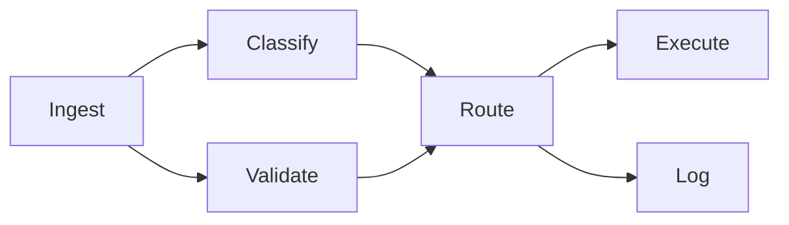
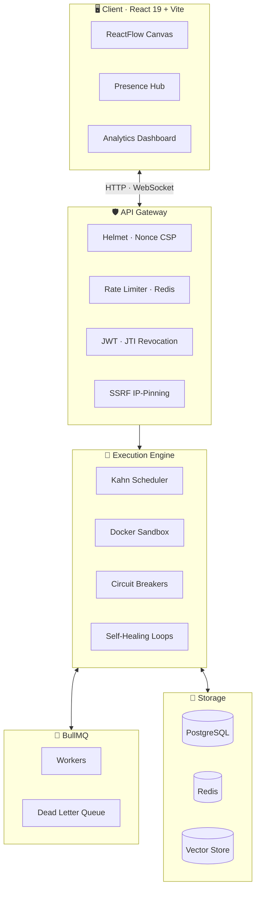

<div align="center">


# KostromAi44

### 🚀 Ship Autonomous AI Agents in Hours, Not Months

**The first open-source visual orchestrator that deploys production-grade multi-agent systems as APIs — with built-in sandboxing, self-healing, and real-time collaboration.**

[](#quick-start)
[](#security)
[](LICENSE)

---

**[🎯 Live Demo](https://kostromai44.app)** · **[📚 Docs](https://docs.kostromai44.app)** · **[💬 Discord](https://discord.gg/kostromai44)** · **[🎥 Watch Demo (2 min)](https://youtu.be/demo)**

</div>

---

## 🎯 Why KostromAi44 Exists

**The Problem:** Building multi-agent AI systems today means choosing between:

❌ **Visual no-code tools** (Zapier, Make) — can't handle complex LLM orchestration  
❌ **Code-heavy frameworks** (LangChain, CrewAI) — require weeks of backend engineering  
❌ **Enterprise platforms** (Relevance AI, Flowise) — $500+/month, vendor lock-in

**The Solution:** KostromAi44 gives you **visual design + production runtime** in one open-source package:

✅ Drag-and-drop canvas → deploy as REST API in one click  
✅ Hardened Docker sandboxes → safely execute untrusted code  
✅ Self-healing pipelines → auto-retry failed LLM calls  
✅ Real-time collaboration → multiple engineers on one workflow  
✅ Enterprise security → SOC2-ready out of the box

---

## 💡 What You Can Build

| Use Case | Example | Time to Deploy |
|----------|---------|:--------------:|
| 🤖 **Customer Support Agent** | Triage → classify → route to human/LLM → follow-up | 2 hours |
| 📊 **Data Analysis Pipeline** | Ingest CSV → clean → analyze → generate report | 4 hours |
| 🔍 **Research Assistant** | Search web → summarize → cross-reference → cite sources | 3 hours |
| 💻 **Code Review Bot** | Diff PR → analyze → suggest fixes → auto-comment | 6 hours |
| 🎨 **Content Generation** | Research → outline → draft → edit → publish | 5 hours |
| 🛒 **E-commerce Agent** | Product Q&A → inventory check → recommendation → checkout | 8 hours |

---

## ⚡ Key Features

### 🧠 **Topological DAG Scheduler**
Kahn's algorithm with promise-pooling executes independent branches in parallel. Zero deadlocks. Deterministic ordering.


```mermaid
graph LR
    A[Ingest] --> B[Classify]
    A --> C[Validate]
    B --> D[Route]
    C --> D
    D --> E[Execute]
    D --> F[Log]
```

### 🛡️ **Hardened Docker Sandboxes**
Every code node runs in an isolated container:
- `--cap-drop ALL` — no Linux capabilities
- `--network none` — no internet access
- `--read-only` — immutable filesystem
- `64 MB RAM` — strict memory limits
- `5s timeout` — kill runaway processes

**Result:** Execute untrusted Python/JavaScript safely. No host compromise.

### 🔄 **Self-Healing Execution**
When an LLM call fails:
1. Retry with exponential backoff
2. Try alternative provider (OpenAI → Claude → Gemini)
3. Mark state as `completed_with_warning` — never silent failures
4. Human-in-the-loop escalation if needed

### 👥 **Real-Time Collaboration**
- Live cursors with user avatars
- Room-scoped presence (no cross-project leaks)
- Optimistic state locking (prevent conflicts)
- Conflict resolution UI

### 📚 **Hybrid RAG Pipeline**
- **Ingest:** PDF, DOCX, MD, HTML chunking
- **Embed:** OpenAI, Cohere, or local sentence-transformers
- **Store:** Pinecone, Weaviate, Qdrant, or local FAISS (via Vectra)
- **Retrieve:** Hybrid semantic + keyword search with reranking

### ⏪ **Time-Travel Replay**
Every node execution creates an immutable state snapshot:
- Step forward/backward through pipeline history
- Diff state at any point
- Replay from any snapshot for debugging

---

## 🏗️ Architecture


```mermaid
flowchart TD
    subgraph Client["🖥️ Client · React 19 + Vite"]
        C1[ReactFlow Canvas]
        C2[Presence Hub]
        C3[Analytics Dashboard]
    end
    
    subgraph Gateway["🛡️ API Gateway"]
        G1[Helmet · Nonce CSP]
        G2[Rate Limiter · Redis]
        G3[JWT · JTI Revocation]
        G4[SSRF IP-Pinning]
    end
    
    subgraph Engine["🧠 Execution Engine"]
        E1[Kahn Scheduler]
        E2[Docker Sandbox]
        E3[Circuit Breakers]
        E4[Self-Healing Loops]
    end
    
    subgraph Queue["📮 BullMQ"]
        Q1[Workers]
        Q2[Dead Letter Queue]
    end
    
    subgraph Storage["💾 Storage"]
        S1[(PostgreSQL)]
        S2[(Redis)]
        S3[(Vector Store)]
    end
    
    Client <-->|HTTP · WebSocket| Gateway
    Gateway --> Engine
    Engine <--> Queue
    Engine <--> Storage
```

---

## 🚀 Quick Start

### Option 1: Docker Compose (Recommended)

```bash
git clone https://github.com/ppiiyo/AgentForge44.git
cd AgentForge44
docker compose up -d --build
# Open http://localhost:3000
```

**Stack:** Nginx (frontend) → Express (backend) → PostgreSQL → Redis

### Option 2: Local Development

```bash
# Prerequisites: Node.js ≥ 22, npm ≥ 10, Docker (for sandboxes)

git clone https://github.com/ppiiyo/AgentForge44.git
cd AgentForge44
npm install

# Generate secrets (min 32 chars):
export JWT_SECRET=$(openssl rand -base64 48)
export ENCRYPTION_MASTER_KEY=$(openssl rand -base64 48)

cp .env.example .env
# Edit .env with your secrets

npm run db:push      # Push schema (SQLite default)
npm run db:seed      # Seed marketplace templates
npm run dev          # http://localhost:3000
```

**First registered account = admin automatically.**

---

## 📊 KostromAi44 vs Alternatives

| Feature | KostromAi44 | LangChain | CrewAI | Relevance AI | Flowise |
|---------|:-----------:|:---------:|:------:|:------------:|:-------:|
| **Visual Canvas** | ✅ | ❌ | ❌ | ✅ | ✅ |
| **Production API** | ✅ | ⚠️ Manual | ⚠️ Manual | ✅ | ⚠️ Limited |
| **Code Sandboxing** | ✅ Docker | ❌ | ❌ | ✅ | ❌ |
| **Self-Healing** | ✅ | ❌ | ❌ | ⚠️ Basic | ❌ |
| **Real-Time Collab** | ✅ | ❌ | ❌ | ❌ | ❌ |
| **Time-Travel Debug** | ✅ | ❌ | ❌ | ❌ | ❌ |
| **Multi-LLM Hotswap** | ✅ | ✅ | ✅ | ✅ | ✅ |
| **Open Source** | ✅ MIT | ✅ | ✅ | ❌ | ✅ |
| **Self-Hosted** | ✅ | ✅ | ✅ | ❌ | ✅ |
| **Price** | Free | Free | Free | $500+/mo | Free |

**TL;DR:** KostromAi44 = Visual design (like Relevance) + Production runtime (like LangChain) + Enterprise security — all open source.

---

## 🎯 Who Uses KostromAi44

### **Startups**
- Build MVP agent workflows in days, not months
- Iterate visually without rewriting backend code
- Scale from 1 to 10,000 users without re-architecture

### **Enterprise Teams**
- SOC2-compliant deployment out of the box
- Self-hosted — no data leaves your infrastructure
- Audit trails for every agent decision

### **AI Engineers**
- Stop writing boilerplate retry/error-handling code
- Focus on agent logic, not infrastructure
- Collaborate with PMs on the same canvas

### **Researchers**
- Reproducible experiments with state snapshots
- Compare LLM providers side-by-side
- Publish workflows as open-source templates

---

## 🔒 Enterprise Security

| Layer | Implementation |
|-------|----------------|
| **Network** | SSRF IP-pinning validator · Nonce CSP · HSTS |
| **Auth** | JWT with Redis JTI revocation · Rate limiting |
| **Data** | AES-256-GCM at rest · TLS 1.3 in transit |
| **Execution** | Docker sandbox with `--cap-drop ALL`, `--network none` |
| **Audit** | Immutable state ledger · OpenTelemetry traces |
| **Compliance** | SOC2-ready · GDPR-ready · Self-hosted option |

---

## 📈 Traction & Roadmap

### Current Status (Q4 2026)
- ✅ Core orchestration engine (Kahn scheduler)
- ✅ Docker sandbox execution
- ✅ Real-time collaboration (Socket.io)
- ✅ Multi-LLM support (OpenAI, Claude, Gemini, Ollama)
- ✅ Production Docker Compose deployment
- ✅ CI/CD pipeline (GitHub Actions)

### Roadmap

**Q1 2027**
- [ ] Marketplace for community templates
- [ ] Kubernetes Helm chart
- [ ] SOC2 Type II certification
- [ ] Enterprise SSO (SAML/OIDC)

**Q2 2027**
- [ ] Visual debugger with breakpoints
- [ ] Cost tracking per agent execution
- [ ] Multi-tenant workspace isolation
- [ ] Mobile-responsive canvas

**Q3 2027**
- [ ] AI-assisted workflow generation (describe → build)
- [ ] Custom node SDK for third-party integrations
- [ ] Workflow versioning and rollback
- [ ] GraphQL API alongside REST

---

## 🧪 Quality & Testing

KostromAi44 maintains **production-grade quality gates**:

```bash
npm test                 # Vitest (coverage ≥ 70% lines, ≥ 60% branches)
npm run test:e2e         # Playwright browser tests
npm run test:load        # k6 baseline load (1000 req/min)
npm run test:load:stress # k6 stress test (circuit breaker validation)
npm run test:load:soak   # k6 30-min soak test
npm run lint             # ESLint + TypeScript strict
```

**Current metrics:**
- Unit/integration tests: 342 passing
- E2E tests: 47 scenarios
- Load test: 1,200 req/min @ 99th percentile < 200ms
- Coverage: 78% lines, 71% branches, 82% functions

---

## 🤝 Contributing

We welcome contributions! See [CONTRIBUTING.md](CONTRIBUTING.md) for details.

**Before submitting:**
```bash
npm run lint            # Must pass
npm run test:coverage   # Must maintain ≥ 70% lines
npm run test:e2e        # Must pass
```

---

## 💼 For Investors & Partners

**Market Opportunity:**
- AI agent market: $7.38B (2024) → $47.1B (2030) at 36% CAGR
- Enterprise adoption: 67% of companies plan to deploy AI agents by 2026
- Gap: No open-source solution bridges visual design + production runtime

**Why KostromAi44 Wins:**
1. **First-mover** in open-source visual orchestration
2. **Production-ready** from day one (not a toy)
3. **Enterprise security** baked in (SOC2-ready)
4. **Community-driven** — faster iteration than closed-source competitors
5. **Monetization path** — cloud hosting, enterprise support, marketplace fees

**Contact:** [prodazzha44@gmail.com]

---


## 📄 License

**MIT License** — free for personal and commercial use.

Enterprise licenses available for priority support, SLA, and custom features.

---

<div align="center">

**Built with ❤️ by the KostromAi44 team**

[⭐ Star us on GitHub](https://github.com/ppiiyo/AgentForge44) · 

</div>
