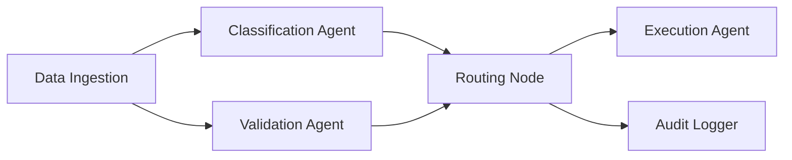
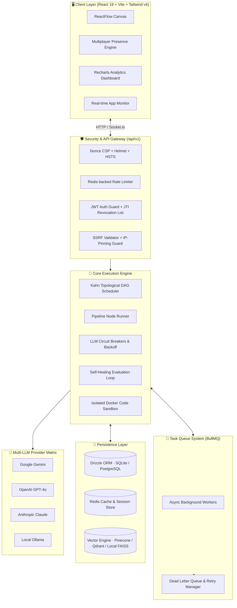

<div align="center">


# 🌌 KostromAi44

### **Production-Grade Visual Orchestrator & Execution Engine for Autonomous Multi-Agent AI Systems**

**Deploy self-healing, multi-agent AI networks as scalable REST & WebSocket APIs in minutes — backed by hardened Docker sandboxing, topological execution, and real-time multiplayer collaboration.**

[](#-quick-start)
[](#-enterprise-security)
[](https://www.typescriptlang.org/)
[](https://react.dev/)
[](LICENSE)

---

🌐 **Languages:** &nbsp; [**English**](README.md) &nbsp;|&nbsp; [**Русский**](README.ru.md) &nbsp;|&nbsp; [**简体中文**](README.zh.md)

---

[**🎯 Live Demo**](https://kostromai44.app) &nbsp;•&nbsp; [**📚 Documentation**](https://docs.kostromai44.app) &nbsp;•&nbsp; [**💬 Discord Community**](https://discord.gg/kostromai44) &nbsp;•&nbsp; [**🎥 2-Min Demo Video**](https://youtu.be/demo)

</div>

---

## 📋 Table of Contents

- [🌌 Overview](#-overview)
- [🎯 Why KostromAi44?](#-why-kostromai44)
- [💡 What You Can Build](#-what-you-can-build)
- [⚡ Key Architecture & Features](#-key-architecture--features)
- [🏗️ System Architecture](#️-system-architecture)
- [📊 KostromAi44 vs Alternatives](#-kostromai44-vs-alternatives)
- [🚀 Quick Start](#-quick-start)
  - [Option 1: Docker Compose (Recommended)](#option-1-docker-compose-recommended)
  - [Option 2: Local Development](#option-2-local-development)
- [⚙️ Environment Configuration](#️-environment-configuration)
- [🔌 API Reference Guide](#-api-reference-guide)
- [🔒 Enterprise Security & Compliance](#-enterprise-security--compliance)
- [🧪 Quality, Testing & CI/CD](#-quality-testing--cicd)
- [🗺️ Product Roadmap](#️-product-roadmap)
- [🤝 Contributing & Community](#-contributing--community)
- [💼 Commercial Support & Contact](#-commercial-support--contact)
- [📄 License](#-license)

---

## 🌌 Overview

**KostromAi44** is an open-source visual orchestrator and production runtime designed for building, testing, debugging, and operating autonomous multi-agent systems. Built with Kahn's topological scheduler, promise-pooled parallel execution, isolated Docker code sandboxing, and real-time multiplayer presence, KostromAi44 bridges the gap between visual low-code workflow design and enterprise-grade backend reliability.

Whether you are deploying customer support agents, automated code reviewers, complex RAG knowledge engines, or data processing pipelines, KostromAi44 enables you to turn visual DAG diagrams into secure, self-healing REST/WebSocket microservices in a single click.

---

## 🎯 Why KostromAi44?

| Challenge in AI Engineering | Traditional Solutions | The KostromAi44 Solution |
| :--- | :--- | :--- |
| **LLM Orchestration Complexity** | **No-Code Tools** (Zapier, Make): Rigid, lack complex LLM branching, state management, or custom code execution. | **Visual DAG Canvas + Full Code Flexibility**: Custom JavaScript/Python nodes executing inside isolated containers. |
| **Backend Engineering Overhead** | **Code Frameworks** (LangChain, CrewAI): Weeks of custom backend code, manual queueing, retry logic, and monitoring. | **One-Click API Deployment**: Instant conversion of visual workflows into versioned `/api/v1` REST & WebSocket endpoints. |
| **Vendor Lock-in & High Cost** | **SaaS Platforms** (Relevance AI, Flowise SaaS): $500+/month, proprietary hosting, potential privacy risks. | **100% Open-Source & Self-Hosted**: MIT License, total data sovereignty, run on your own cloud or on-premise infrastructure. |
| **Untrusted Code Execution** | **Native Execution**: Vulnerable to infinite loops, remote code execution, and filesystem leaks. | **Hardened Docker Sandboxes**: Unprivileged containers with strict memory limits, read-only filesystems, and dropped capabilities. |

---

## 💡 What You Can Build

| Use Case | Architectural Flow | Time to Production |
| :--- | :--- | :---: |
| 🤖 **Autonomous Customer Support** | Email Ingest → Intent Classification → Knowledge Search (RAG) → Human-in-the-Loop Approval → Response | ~2 hours |
| 📊 **Multi-Agent Research & Analysis** | Query Planner → Parallel Web Search → Cross-Verification → Markdown Synthesis → Executive Briefing | ~3 hours |
| 💻 **Automated PR & Code Reviewer** | GitHub Webhook → Git Diff Analysis → Security Audit → Code Style Check → Auto PR Comments | ~4 hours |
| 📚 **Enterprise Hybrid RAG System** | Document Chunking → Multimodal Embedding → Vector Store (Pinecone/Qdrant) → Hybrid Re-Ranking | ~3 hours |
| 🛒 **E-Commerce Concierge Agent** | Natural Language Query → Inventory Check → Personalized Recommendation → Stripe Checkout API | ~5 hours |

---

## ⚡ Key Architecture & Features

### 🧠 **Topological Parallel DAG Scheduler**
Powered by Kahn's algorithm and asynchronous promise pooling, KostromAi44 executes non-dependent workflow nodes in parallel while strictly respecting execution ordering. Zero deadlocks, deterministic execution, and low latency.


```mermaid
graph LR
    A[Data Ingestion] --> B[Classification Agent]
    A --> C[Validation Agent]
    B --> D[Routing Node]
    C --> D
    D --> E[Execution Agent]
    D --> F[Audit Logger]
```

### 🛡️ **Hardened Docker Sandboxing**
Code execution nodes run within ephemeral Docker containers configured with defense-in-depth security:
- `--cap-drop ALL` — Drops all Linux kernel capabilities.
- `--network none` — Completely blocks external network access (unless explicitly routed).
- `--read-only` — Immutable root filesystem.
- `64 MB RAM` — Strict memory quotas.
- `5s Timeout` — Automatically kills runaway scripts.

### 🔄 **Self-Healing Resilient Execution**
LLM provider rate limits and transient errors are automatically mitigated:
1. **Exponential Backoff**: Automatic retry loops with jitter.
2. **Provider Hotswap**: Seamless fallback (e.g., OpenAI → Anthropic Claude → Google Gemini → Local Ollama).
3. **Transparent Auditing**: State marked as `completed_with_warning` instead of silent failures.

### 👥 **Real-Time Multiplayer Collaboration**
Built on Socket.io with room-scoped presence:
- Live multi-user cursor tracking with color-coded user avatars.
- Optimistic node locking to prevent concurrent editing collisions.
- Conflict resolution UI for seamless team workflow design.

### 🕑 **Time-Travel Execution Replay**
Every state mutation across the DAG graph produces an immutable snapshot. Step forward, backward, diff node inputs/outputs, and replay executions from any historical point for instant debugging.

---

## 🏗️ System Architecture


```mermaid
flowchart TD
    subgraph Client["🖥️ Client Layer (React 19 + Vite + Tailwind v4)"]
        Canvas[ReactFlow Canvas]
        Presence[Multiplayer Presence Engine]
        Analytics[Recharts Analytics Dashboard]
        Monitor[Real-time App Monitor]
    end

    subgraph Gateway["🛡️ Security & API Gateway (/api/v1)"]
        CSP[Nonce CSP + Helmet + HSTS]
        RL[Redis-backed Rate Limiter]
        Auth[JWT Auth Guard + JTI Revocation List]
        SSRF[SSRF Validator + IP-Pinning Guard]
    end

    subgraph Engine["🧠 Core Execution Engine"]
        Scheduler[Kahn Topological DAG Scheduler]
        Executor[Pipeline Node Runner]
        Breaker[LLM Circuit Breakers & Backoff]
        Healing[Self-Healing Evaluation Loop]
        Sandbox[Isolated Docker Code Sandbox]
    end

    subgraph Queue["📮 Task Queue System (BullMQ)"]
        Workers[Async Background Workers]
        DLQ[Dead Letter Queue & Retry Manager]
    end

    subgraph Storage["💾 Persistence Layer"]
        DB[(Drizzle ORM · SQLite / PostgreSQL)]
        Cache[(Redis Cache & Session Store)]
        Vector[(Vector Engine · Pinecone / Qdrant / Local FAISS)]
    end

    subgraph LLMs["🤖 Multi-LLM Provider Matrix"]
        Gemini[Google Gemini]
        OpenAI[OpenAI GPT-4o]
        Claude[Anthropic Claude]
        Ollama[Local Ollama]
    end

    Client <-->|HTTP / Socket.io| Gateway
    Gateway --> Engine
    Engine <--> Queue
    Queue --> DLQ
    Engine <--> Storage
    Engine --> LLMs
```

---

## 📊 KostromAi44 vs Alternatives

| Capability / Feature | KostromAi44 | LangChain | CrewAI | Relevance AI | Flowise |
| :--- | :---: | :---: | :---: | :---: | :---: |
| **Visual Interactive Canvas** | ✅ | ❌ | ❌ | ✅ | ✅ |
| **One-Click REST/WS API** | ✅ | ⚠️ Manual | ⚠️ Manual | ✅ | ⚠️ Limited |
| **Docker Code Sandboxing** | ✅ | ❌ | ❌ | ✅ | ❌ |
| **Self-Healing & Fallbacks** | ✅ | ❌ | ❌ | ⚠️ Basic | ❌ |
| **Real-Time Multiplayer** | ✅ | ❌ | ❌ | ❌ | ❌ |
| **Time-Travel Replay** | ✅ | ❌ | ❌ | ❌ | ❌ |
| **Multi-LLM Hotswapping** | ✅ | ✅ | ✅ | ✅ | ✅ |
| **Open Source (MIT)** | ✅ | ✅ | ✅ | ❌ | ✅ |
| **100% Self-Hosted** | ✅ | ✅ | ✅ | ❌ | ✅ |

---

## 🚀 Quick Start

### Option 1: Docker Compose (Recommended)

Get the complete production stack up and running in under 60 seconds:

```bash
# 1. Clone the repository
git clone https://github.com/ppiiyo/AgentForge44.git kostromai44
cd kostromai44

# 2. Start the container stack
docker compose up -d --build

# 3. Access the application at http://localhost:3000
```

*Stack Components:* Nginx Reverse Proxy → Express API Gateway → Node.js Backend → PostgreSQL → Redis → Docker Sandbox Runner.

---

### Option 2: Local Development

Prerequisites: **Node.js ≥ 22.0.0**, **npm ≥ 10.0.0**, and **Docker** (optional, for code execution nodes).

```bash
# 1. Clone and install dependencies
git clone https://github.com/ppiiyo/AgentForge44.git kostromai44
cd kostromai44
npm install

# 2. Configure environment variables
cp .env.example .env

# Generate secure 32+ character secrets
export JWT_SECRET=$(openssl rand -base64 48)
export ENCRYPTION_MASTER_KEY=$(openssl rand -base64 48)

# 3. Initialize Database & Seed Templates
npm run db:push     # Pushes schema (SQLite by default)
npm run db:seed     # Seeds pre-built marketplace workflows

# 4. Launch Development Server
npm run dev
```

Navigate to **`http://localhost:3000`**. The first registered user account is automatically granted **System Administrator (Admin)** privileges.

---

## ⚙️ Environment Configuration

| Variable | Type | Default | Description |
| :--- | :---: | :---: | :--- |
| `PORT` | `number` | `3000` | Application HTTP service port |
| `NODE_ENV` | `string` | `development` | Environment mode (`development`, `production`, `test`) |
| `JWT_SECRET` | `string` | *Required* | Secret key for JWT signing (min 32 characters) |
| `ENCRYPTION_MASTER_KEY` | `string` | *Required* | Master key for AES-256-GCM database credential encryption |
| `DB_TYPE` | `string` | `sqlite` | Database engine adapter (`sqlite` or `postgres`) |
| `DATABASE_URL` | `string` | — | Connection string for PostgreSQL database |
| `REDIS_URL` | `string` | — | Redis connection URL for BullMQ queues and caching |
| `GEMINI_API_KEY` | `string` | — | Google AI Studio Gemini API key |
| `OPENAI_API_KEY` | `string` | — | OpenAI API key |
| `ANTHROPIC_API_KEY` | `string` | — | Anthropic Claude API key |
| `OLLAMA_HOST` | `string` | `http://localhost:11434` | Local Ollama instance URL |

---

## 🔌 API Reference Guide

All API endpoints are prefixed with versioned routing **`/api/v1`** (with backward compatibility for **`/api`**).

| Method | Endpoint | Description | Auth Required |
| :--- | :--- | :--- | :---: |
| `POST` | `/api/v1/auth/register` | Register new user account (1st user = Admin) | No |
| `POST` | `/api/v1/auth/login` | Authenticate user & return JWT token | No |
| `POST` | `/api/v1/auth/logout` | Revoke JWT token via Redis JTI blacklist | Yes |
| `POST` | `/api/v1/execute/graph` | Synchronously execute raw DAG graph structure | Yes |
| `POST` | `/api/v1/execute/blueprint` | Execute a saved pipeline workflow by Blueprint ID | Yes |
| `POST` | `/api/v1/runs` | Dispatch asynchronous background execution task | Yes |
| `GET` | `/api/v1/runs/:id` | Fetch task status, execution logs, and output state | Yes |
| `GET` | `/api/v1/health` | Comprehensive system & component health probe | No |
| `GET` | `/metrics` | Prometheus metrics scrape endpoint | Yes |

Interactive Swagger OpenAPI documentation is served live at **`/api-docs`**.

---

## 🔒 Enterprise Security & Compliance

KostromAi44 is engineered with a security-first architecture ready for enterprise deployment:

- **Network Defense**: Nonce-based Content Security Policy (CSP), SSRF protection with strict IP pinning, HSTS enabled.
- **Authentication & AuthZ**: JWT tokens validated against a Redis `jti` revocation blacklist; role-based access control (RBAC).
- **Data Protection**: AES-256-GCM encryption at rest for external API keys; TLS 1.3 in transit.
- **Execution Security**: Isolated root-less Docker containers for untrusted user code execution.
- **Auditability**: Immutable audit logs for every workflow execution and node output snapshot.

---

## 🧪 Quality, Testing & CI/CD

KostromAi44 enforces strict quality gates across the entire codebase:

```bash
# Run unit and integration tests (Vitest)
npm test

# Verify coverage thresholds (Lines ≥ 70%, Functions ≥ 70%, Branches ≥ 60%)
npm run test:coverage

# Execute Playwright end-to-end (E2E) browser tests
npm run test:e2e

# Run k6 performance & stress tests
npm run test:load

# Perform strict TypeScript compilation & ESLint checks
npm run lint
```

---

## 🗺️ Product Roadmap

### 🟢 Q4 2026 (Completed)
- [x] Topological Kahn DAG Scheduler with promise-pooling.
- [x] Hardened Docker code execution sandbox.
- [x] Socket.io real-time multiplayer collaboration.
- [x] Multi-LLM support (Gemini, OpenAI, Claude, Ollama).
- [x] Production Docker Compose containerization.

### 🟡 Q1 2027 (In Progress)
- [ ] Community Template Marketplace for one-click workflow sharing.
- [ ] Kubernetes Helm Chart & Operator deployment package.
- [ ] Enterprise Single Sign-On (SAML 2.0 / OIDC).

### 🔵 Q2 2027 (Planned)
- [ ] Visual Step-by-Step Breakpoint Debugger.
- [ ] Real-time Token & Cost Tracking per agent run.
- [ ] Multi-tenant workspace data isolation boundaries.

---

## 🤝 Contributing & Community

We welcome contributions from developers, researchers, and AI enthusiasts!

1. Fork the repository on GitHub.
2. Create your feature branch (`git checkout -b feature/amazing-feature`).
3. Ensure all tests and linter checks pass (`npm run lint && npm test`).
4. Commit your changes (`git commit -m 'feat: Add amazing feature'`).
5. Push to the branch (`git push origin feature/amazing-feature`).
6. Open a Pull Request.

Please refer to [`CONTRIBUTING.md`](CONTRIBUTING.md) for detailed guidelines.

---

## 💼 Commercial Support & Contact

Need help deploying KostromAi44 in an enterprise environment or requiring custom integrations?

- **Website**: [https://kostromai44.app](https://kostromai44.app)
- **Email Contact**: [prodazzha44@gmail.com](mailto:prodazzha44@gmail.com)
- **Discord**: [Join the KostromAi44 Discord Server](https://discord.gg/kostromai44)

---

## 📄 License

This project is open-source software licensed under the **[MIT License](LICENSE)**.

---

<div align="center">

**Built with ❤️ by the KostromAi44 Engineering Team**

[**Back to Top ⬆️**](#-kostromai44)

</div>
