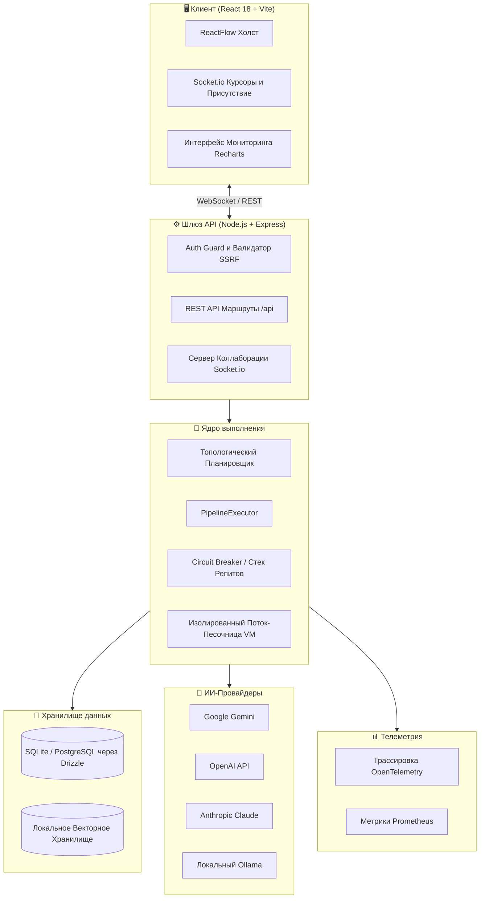

<div align="center">


# 🌌 KostromAi44

### Визуальный low-code оркестратор отказоустойчивых самокорректирующихся пайплайнов мультиагентных LLM

**Проектируйте сложные цепочки рассуждений на холсте. Запускайте в продакшене через надежный REST API. Наблюдайте за всем в реальном времени.**

<p>
  <a href="./README.md">🇺🇸 English</a> &nbsp;|&nbsp;
  <b>🇷🇺 Русский</b> &nbsp;|&nbsp;
  <a href="./README.zh.md">🇨🇳 中文</a>
</p>

<p>


</p>

</div>

---

## ✨ Обзор

**KostromAi44** — это промышленная low-code платформа визуального моделирования и оркестрации ИИ-агентов. С ее помощью вы можете создавать сложные цепочки рассуждений моделей, условия ветвления, модули семантического поиска RAG и циклы самокоррекции на интерактивном холсте, а затем разворачивать полученный пайплайн в виде высокодоступного и отказоустойчивого REST API.

Платформа объединяет современные ИИ-провайдеры (**Google Gemini, OpenAI, Anthropic Claude и локальный Ollama**), реализует надежную очередь выполнения и предоставляет передовые инструменты мониторинга (Observability) и безопасности "из коробки".

---

## 🎨 Премиальный Редизайн и Опыт Пользователя (UI/UX) в стиле "X"

Интерфейс платформы был полностью переосмыслен согласно канонам передового продуктового дизайна:
- **Эстетика "X" (Twitter) в глубоком Dark Mode**: Использование ультраконтрастных тонов Pitch Black и матового цинка для лучшей читаемости, фокусирующей все внимание разработчика исключительно на структуре агентов.
- **Современная объемная глубина (Modern Depth)**: Мягкие размытия стекла (Glassmorphism), элегантные ультратонкие границы `border-neutral-900` вместо тяжелых рамок и кастомные многослойные тени (`shadow-volumetric`) для ощущения физического объема интерфейса.
- **Смелая контрастная типографика**: Четкие заголовки шрифта `Space Grotesk` в сочетании с высокочитаемым `JetBrains Mono` для логов, параметров узлов и индикаторов производительности.
- **Абсолютная чистота**: Полное исключение "ИИ-мусора", псевдоинформационных терминальных строк и лишнего визуального шума ради достижения принципа Progressive Disclosure.

---

## 🗺️ Содержание

- [Функциональные возможности](#-функциональные-возможности)
- [Типы узлов](#-типы-узлов)
- [Архитектура](#-архитектура)
- [Стек технологий](#-стек-технологий)
- [Быстрый старт](#-быстрый-старт)
- [Конфигурация](#-конфигурация)
- [Использование API](#-использование-api)
- [Observability (Наблюдаемость)](#-observability-наблюдаемость)
- [Безопасность](#-безопасность)
- [Тестирование](#-тестирование)
- [Развертывание](#-развертывание)
- [Лицензия](#-лицензия)

---

## 🚀 Функциональные возможности

| Функция | Описание |
|---|---|
| 🎨 **Визуальный холст** | Drag-and-drop редактор графов (ReactFlow) с автовыравниванием по сетке (Snap-to-Grid). |
| 🤖 **Мультипровайдерный LLM** | Единый SDK интерфейс для Gemini, OpenAI, Claude и локального Ollama. |
| 🔄 **Циклы самокоррекции** | Узлы рецензирования (Reviewer) оценивают выводы и автоматически возвращают граф на доработку при несоответствии критериям. |
| 🗃️ **Полиморфная БД** | Бесшовное переключение между SQLite для локальных тестов и PostgreSQL для продакшена. |
| ⚡ **Параллельное выполнение** | Высокопроизводительный топологический шедулер запускает независимые ветви вычислений параллельно. |
| 📦 **Самовосстанавливающиеся миграции** | Транзакционный автомигратор Drizzle разворачивает структуру таблиц при старте сервиса. |
| 🛡️ **Защита Enterprise-класса** | Встроенные SSRF-фильтры, безопасное PBKDF2-SHA512 хеширование паролей, маскирование секретов AES-256-GCM. |
| 🔌 **Устойчивость к сбоям** | Повторные попытки Exponential Backoff с фазовым шумом Jitter, плавные предохранители Circuit Breaker. |
| 📊 **3D RAG-визуализатор** | Интерактивное отображение кластеров эмбеддингов и семантических связей в трехмерном пространстве. |
| 📚 **RAG Индексатор и Просмотрщик** | Продвинутый парсер и разбиватель документов (chunker) с поддержкой бинарных файлов PDF и Microsoft Word (.docx), а также текстовых TXT и Markdown. Интерактивный визуальный каталог с глубоким поиском и подсветкой совпадений. |
| 👥 **Совместное редактирование** | WebSocket-синхронизация курсоров, активности пользователей и динамических блокировок через Socket.io. |
| 🔍 **Распределенный мониторинг** | Глубокая интеграция распределенных трассировок OpenTelemetry и метрик Prometheus. |
| 🕑 **Путешествие во времени** | Git-style система снимков состояний графа со сравнительным Diff-анализом версий. |
| 🎭 **Мультиагентные дебаты** | Структурированные дебаты между полярными ролями ИИ-агентов с автоматическим арбитражем и выработкой консенсуса. |
| 🧠 **Оптимизатор топологии** | Автоматический аудит архитектуры графа на холсте для выявления слабых мест, узких горлышек и уязвимостей. |
| 🔒 **Zero-Trust маскирование** | Локальное шифрование и скрытие PII, e-mail и API токенов (AES-256) для защиты конфиденциальных данных. |
| 💬 **Интерактивный гейт** | Приостановка выполнения графа на ключевых узлах для ручного подтверждения оператором или прямого чата. |
| 🔌 **Динамическая оркестрация MCP** | Интеграция и авторизация сторонних Model Context Protocol (MCP) серверов напрямую из панели синхронизации для предоставления ИИ-агентам доступа к системным инструментам (базы данных, файловая система, Puppeteer). |
| ⏱️ **Изменение памяти шага на лету** | Интерактивное переопределение входных и выходных переменных на любом шаге отладки Snapshot Debugger с мгновенным каскадным обновлением рантайма холста. |
| 🔔 **Глобальный перехват ошибок (Toast)** | Кастомное Middleware-перехватчик клиентских HTTP-запросов fetch для мгновенного вывода анимированных Toast-уведомлений при сетевых сбоях и отказах API, исключающее "молчаливое" падение пайплайнов. |

---

## 🧩 Типы узлов

| Тип узла | Описание / Предназначение |
|---|---|
| `Input` | Точка входа графа. Собирает входящие переменные и рантайм-параметры. |
| `Prompt` | Проектирует шаблоны промптов с поддержкой Mustache/Handlebars синтаксиса. |
| `LLM Engine` | Отправляет запросы к моделям с кастомной температурой, системными инструкциями и лимитом токенов. |
| `Reviewer` | Оценивает ответы вышестоящих узлов и направляет граф по циклу назад при плохом качестве. |
| `Router` | Выполняет условное ветвление потока на основе регулярных выражений или скрипта. |
| `RAG / Knowledge` | Семантический поиск и извлечение релевантных фрагментов из базы знаний. |
| `Tool / Code` | Безопасное выполнение пользовательского JavaScript кода в изолированной песочнице VM. |
| `Output` | Консолидирует финальные вычисления и формирует структурированный ответ API. |
| `Debate` | Организует структурированный спор двух агентов (PRO/CON) под управлением арбитра для выявления консенсуса. |
| `Human Confirmation` | Интерактивный рубеж ручной валидации с поддержкой прямого чата и на лету редактирования переменных. |
| `Prompt Optimizer` | Автоматически полирует, расширяет и оптимизирует промпты с помощью критики ИИ перед их отправкой в LLM. |

---

## 🏗️ Архитектура



---

## 🛠️ Стек технологий

- **Фронтенд**: React 18+, Vite, Tailwind CSS, Framer Motion, ReactFlow, Lucide Icons, Recharts
- **Бэкенд**: Node.js, Express, TSX, Winston, Socket.io
- **Базы данных**: Drizzle ORM, SQLite, PostgreSQL
- **Интеграция ИИ**: `@google/genai`, `openai`, `@anthropic-ai/sdk`, `ollama`
- **Телеметрия**: OpenTelemetry SDK + Tracing API, `prom-client` (Prometheus)
- **Безопасность**: PBKDF2-SHA512 хеширование, шифрование AES-256-GCM, SSRF блокиратор хостов

---

## ⚡ Быстрый старт

> 📖 **Важное примечание для быстрого начала:** Мы подготовили подробное пошаговое руководство по получению API-ключей (Google Gemini, OpenAI, Claude, Ollama, Pinecone, Tavily), генерации криптографических секретов и запуску. Ознакомьтесь с ним здесь: **[ПОДРОБНАЯ ИНСТРУКЦИЯ ПО НАСТРОЙКЕ КЛЮЧЕЙ И ЗАПУСКУ](./INSTRUCTIONS.ru.md)**.

### 🐳 Вариант А: Использование Docker Compose (Рекомендуемый)
Убедитесь, что на вашем компьютере установлен Docker:
```bash
# 1. Клонируйте проект
git clone https://github.com/igraybalalayka/KostromAi44.git
cd KostromAi44

# 2. Запустите мультиконтейнерную среду
docker-compose up --build
```
Интерфейс будет доступен по адресу: **[http://localhost:3000](http://localhost:3000)**.

### 🖥️ Вариант Б: Локальный запуск
Требуется установленная **Node.js v18** или новее:
```bash
# 1. Установите зависимости
npm install

# 2. Скопируйте файл конфигурации окружения
cp .env.example .env

# Генерация обязательных криптографических секретов
echo "JWT_SECRET=$(openssl rand -base64 48)" >> .env
echo "ENCRYPTION_MASTER_KEY=$(openssl rand -base64 48)" >> .env

# 3. Запустите fullstack сервер разработки
npm run dev
```
Откройте в браузере: **[http://localhost:3000](http://localhost:3000)**.

> 💡 **Режим Презентационной Песочницы:** Если вы оставите `GEMINI_API_KEY=sandbox_free_test_gemini`, холст будет имитировать качественные ответы языковых моделей без списания баланса и без необходимости ввода реального API ключа.

---

## ⚙️ Конфигурация

Ключевые переменные окружения (задаются в [`.env.example`](./.env.example)):

| Переменная | Обязательна | Описание |
|---|:---:|---|
| `JWT_SECRET` | Да | Секрет подписи JWT токенов сессий (минимум 32 символа). |
| `ENCRYPTION_MASTER_KEY`| Да | Симметричный ключ AES-256-GCM для шифрования API-ключей в БД. |
| `GEMINI_API_KEY` | Нет | Ключ доступа Google AI Studio (или `sandbox_free_test_gemini`). |
| `DB_TYPE` | Нет | Движок СУБД: `sqlite` (по умолчанию) или `postgres`. |
| `DATABASE_URL` | Нет | Строка подключения к СУБД PostgreSQL (если выбран тип postgres). |
| `SENTRY_DSN` | Нет | Интеграция мониторинга ошибок и логов в Sentry. |

---

## 🔌 Использование API

Интерактивная спецификация Swagger доступна по адресу **`GET /api-docs`**.

### 1. Сохранить/Обновить граф потока (`POST /api/graphs`)
```bash
curl -X POST http://localhost:3000/api/graphs \
  -H "Content-Type: application/json" \
  -H "Authorization: Bearer <JWT_TOKEN>" \
  -d '{
    "id": "translation-validator",
    "name": "Валидатор Локализации",
    "nodes": [
      {
        "id": "prompt-input",
        "type": "prompt",
        "fields": { "text": "Переведи и адаптируй текст: {{input_text}}" }
      }
    ],
    "connections": []
  }'
```

### 2. Запустить пайплайн агентов на выполнение (`POST /api/execute`)
```bash
curl -X POST http://localhost:3000/api/execute \
  -H "Content-Type: application/json" \
  -d '{
    "graphId": "translation-validator",
    "inputs": {
      "input_text": "Good morning, developers!"
    }
  }'
```

---

## 📊 Observability (Наблюдаемость)

- **Прометеус Скрейпер**: Совместимый эндпоинт `GET /metrics` отслеживает общие HTTP-вызовы, время задержки API, расходы токенов и количество вызовов моделей.
- **Распределенные трейсы OTel**: Сквозная трассировка запросов через сетевые границы позволяет визуализировать задержки шагов графа в Zipkin или Jaeger.
- **Грациозное завершение (Graceful Shutdown)**: Сервер правильно обрабатывает системные прерывания `SIGTERM` / `SIGINT`, сбрасывая логи, завершая трейсы и плавно закрывая пулы соединений СУБД.

---

## 🛡️ Безопасность

1. **Блокировщик SSRF**: Предотвращает несанкционированное сканирование внутренней сетевой инфраструктуры, блокируя локальные IP-диапазоны (`127.0.0.1`, `10.0.0.0/8`, `192.168.0.0/16`).
2. **Очистка логов**: Рекурсивно очищает JSON payloads перед выводом в консоль или сохранением, заменяя поля `api_key`, `password`, `jwt_token` на защищенные плейсхолдеры.
3. **Защита от ReDoS**: Пул валидаторов регулярных выражений блокирует паттерны, вызывающие катастрофическое возвращение (catastrophic backtracking).
4. **Песочница кода**: Скрипты пользователя в узлах-инструментах (`Tool`) выполняются в жестко ограниченных дочерних Worker-потоках без прямого доступа к файловой системе хоста.

---

## 🧪 Тестирование

```bash
npm run test           # Запуск юнит и интеграционных тестов Vitest
npm run test:coverage  # Генерация отчета о покрытии тестами
npm run test:e2e       # Запуск автоматизации браузера Playwright
npm run lint           # Проверка синтаксиса и статический анализ ESLint
```

---

## 📜 Лицензия

Проект распространяется на условиях лицензии **MIT**. См. подробности в файле [LICENSE](./LICENSE).

<div align="center">

**Создано с ❤️ для сообщества разработчиков надежного ИИ.**

</div>
