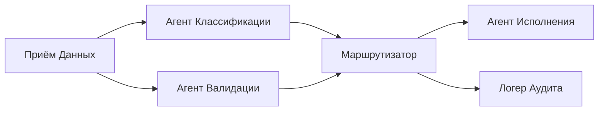
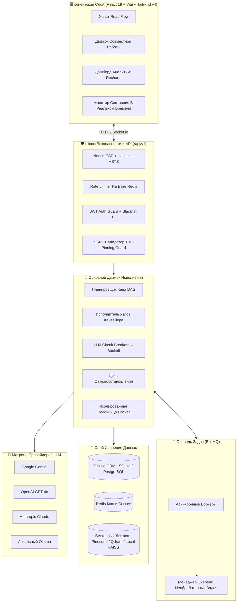

<div align="center">


# 🌌 KostromAi44

### **Визуальный Low-Code Оркестратор и Исполнительный Движок Промышленного Уровня для Мультиагентных ИИ-Систем**

**Разворачивайте самовосстанавливающиеся мультиагентные ИИ-сети в виде масштабируемых REST и WebSocket API за считанные минуты — с встроенной песочницей Docker, топологическим планировщиком и совместной работой в реальном времени.**

[](#-быстрый-старт)
[](#-корпоративная-безопасность)
[](https://www.typescriptlang.org/)
[](https://react.dev/)
[](LICENSE)

---

🌐 **Языки:** &nbsp; [**English**](README.md) &nbsp;|&nbsp; [**Русский**](README.ru.md) &nbsp;|&nbsp; [**简体中文**](README.zh.md)

---

[**🎯 Демо Онлайн**](https://kostromai44.app) &nbsp;•&nbsp; [**📚 Документация**](https://docs.kostromai44.app) &nbsp;•&nbsp; [**💬 Discord Сообщество**](https://discord.gg/kostromai44) &nbsp;•&nbsp; [**🎥 Видео-Демо (2 мин)**](https://youtu.be/demo)

</div>

---

## 📋 Оглавление

- [🌌 Обзор Проекта](#-обзор-проекта)
- [🎯 Почему KostromAi44?](#-почему-kostromai44)
- [💡 Что Можно Построить](#-что-можно-построить)
- [⚡ Ключевая Архитектура и Возможности](#-ключевая-архитектура-и-возможности)
- [🏗️ Архитектура Системы](#️-архитектура-системы)
- [📊 KostromAi44 в Сравнении с Аналогами](#-kostromai44-в-сравнении-с-аналогами)
- [🚀 Быстрый Старт](#-быстрый-старт)
  - [Вариант 1: Docker Compose (Рекомендуется)](#вариант-1-docker-compose-рекомендуется)
  - [Вариант 2: Локальная Разработка](#вариант-2-локальная-разработка)
- [⚙️ Переменные Окружения](#️-переменные-окружения)
- [🔌 Справочник API](#-справочник-api)
- [🔒 Корпоративная Безопасность](#-корпоративная-безопасность)
- [🧪 Качество Кода, Тестирование и CI/CD](#-качество-кода-тестирование-и-cicd)
- [🗺️ Дорожная Карта (Roadmap)](#️-дорожная-карта-roadmap)
- [🤝 Вклад в Проект и Сообщество](#-вклад-в-проект-и-сообщество)
- [💼 Поддержка и Контакты](#-поддержка-и-контакты)
- [📄 Лицензия](#-license)

---

## 🌌 Обзор Проекта

**KostromAi44** — это корпоративный открытый визуальный оркестратор и среда исполнения для конструирования, тестирования, отладки и эксплуатации автономных мультиагентных ИИ-систем. Основанный на топологическом планировщике Кана, параллельном Promise-пулинге, изолированной Docker-песочнице и совместной работе в реальном времени, KostromAi44 объединяет удобство визуального конструктора и надёжность промышленного бэкенда.

Разворачиваете ли вы агентов службы поддержки, автоматических рецензентов кода, сложные гибридные RAG-системы или конвейеры обработки данных — KostromAi44 превратит визуальные графы в защищённые REST/WebSocket микросервисы в один клик.

---

## 🎯 Почему KostromAi44?

| Проблема в ИИ-Инженерии | Традиционные Решения | Решение KostromAi44 |
| :--- | :--- | :--- |
| **Сложность Оркестрации LLM** | **No-Code Инструменты** (Zapier, Make): Ограничены, не справляются со сложными ветвлениями, состояниями и кодом. | **Визуальный DAG Canvas + Код**: Узлы с кастомным кодом JS/Python, исполняемые внутри изолированных контейнеров. |
| **Затраты на Разработку Бэкенда** | **Фреймворки** (LangChain, CrewAI): Недели написания кода бэкенда, очередей, логики повторов и мониторинга. | **Деплой в API в Один Клик**: Мгновенная конверсия визуальных графов в версионируемые REST и WebSocket эндпоинты `/api/v1`. |
| **Зависимость от Провайдера** | **SaaS Платформы** (Relevance AI, Flowise SaaS): От $500/мес, закрытый код, риски утечки данных. | **100% Open-Source & Self-Hosted**: Лицензия MIT, полный контроль над данными, запуск в своём облаке или On-Premise. |
| **Опасность Недоверенного Кода** | **Прямое Исполнение**: Уязвимость к бесконечным циклам, RCE-атакам и утечкам файловой системы. | **Изолированные Docker Песочницы**: Root-less контейнеры с ограничениями RAM, read-only ФС и сброшенными capabilities. |

---

## 💡 Что Можно Построить

| Сценарий Использования | Архитектурный Поток | Время до Продакшена |
| :--- | :--- | :---: |
| 🤖 **Автономный Агент Поддержки** | Приём Письма → Классификация Намерений → Поиск в Знаниях (RAG) → Согласование Человеком → Ответ | ~2 часа |
| 📊 **Мультиагентный Исследователь** | Планировщик Запросов → Параллельный Поиск в Вебе → Кросс-Проверка → Синтез Markdown → Отчёт | ~3 часа |
| 💻 **Автоматический Рецензент PR** | GitHub Webhook → Анализ Git Diff → Аудит Безопасности → Проверка Стиля → Авто-Комментирование | ~4 часа |
| 📚 **Корпоративный Гибридный RAG** | Чанкинг Документов → Мультимодальные Векторы → Векторная БД (Pinecone/Qdrant) → Гибридный Реранкинг | ~3 часа |
| 🛒 **Персональный Консьерж Магазина** | Запрос на Естественном Языке → Проверка Наличия → Рекомендации → Stripe Checkout API | ~5 часов |

---

## ⚡ Ключевая Архитектура и Возможности

### 🧠 **Топологический Параллельный Планировщик DAG**
Благодаря алгоритму Кана и асинхронному пулу Promise, KostromAi44 выполняет независимые узлы конвейера параллельно с гарантированным соблюдением порядка. Нулевой риск дедлоков, детерминированное выполнение и минимальная задержка.


```mermaid
graph LR
    A[Приём Данных] --> B[Агент Классификации]
    A --> C[Агент Валидации]
    B --> D[Маршрутизатор]
    C --> D
    D --> E[Агент Исполнения]
    D --> F[Логер Аудита]
```

### 🛡️ **Защищённая Песочница Docker**
Узлы выполнения кода запускаются внутри контейнеров Docker с комплексной защитой:
- `--cap-drop ALL` — Полный сброс привилегий ядра Linux.
- `--network none` — Блокировка внешнего сетевого доступа (если не разрешено явно).
- `--read-only` — Неизменяемая корневая файловая система.
- `64 MB RAM` — Строгий лимит оперативной памяти.
- `5s Timeout` — Автоматическое завершение зависших процессов.

### 🔄 **Самовосстановление с Честной Телеметрией**
Ограничения по тарифам и сбои LLM-провайдеров автоматически компенсируются:
1. **Экспоненциальный Откат**: Автоматические повторы с джиттером.
2. **Горячая Замена Провайдера**: Автоматическое переключение (OpenAI → Claude → Gemini → Local Ollama).
3. **Прозрачный Аудит**: Статус `completed_with_warning` исключает скрытые ошибки.

### 👥 **Совместная Работа в Реальном Времени**
На базе Socket.io с комнатной изоляцией присутствия:
- Отслеживание курсоров пользователей в реальном времени с цветными аватарами.
- Оптимистичная блокировка узлов для предотвращения конфликтов редактирования.
- Интерфейс разрешения конфликтов при командной разработке.

### 🕑 **Отладчик «Путешествие во Времени»**
Каждое изменение состояния графа создает неизменяемый снимок. Перематывайте выполнение вперёд и назад, сравнивайте входы и выходы узлов для мгновенной отладки.

---

## 🏗️ Архитектура Системы


```mermaid
flowchart TD
    subgraph Client["🖥️ Клиентский Слой (React 19 + Vite + Tailwind v4)"]
        Canvas[Холст ReactFlow]
        Presence[Движок Совместной Работы]
        Analytics[Дашборд Аналитики Recharts]
        Monitor[Монитор Состояния В Реальном Времени]
    end

    subgraph Gateway["🛡️ Шлюз Безопасности и API (/api/v1)"]
        CSP[Nonce CSP + Helmet + HSTS]
        RL[Rate Limiter На Базе Redis]
        Auth[JWT Auth Guard + Blacklist JTI]
        SSRF[SSRF Валидатор + IP-Pinning Guard]
    end

    subgraph Engine["🧠 Основной Движок Исполнения"]
        Scheduler[Планировщик Кана DAG]
        Executor[Исполнитель Узлов Конвейера]
        Breaker[LLM Circuit Breakers и Backoff]
        Healing[Цикл Самовосстановления]
        Sandbox[Изолированная Песочница Docker]
    end

    subgraph Queue["📮 Очередь Задач (BullMQ)"]
        Workers[Асинхронные Воркеры]
        DLQ[Менеджер Очереди Необработанных Задач]
    end

    subgraph Storage["💾 Слой Хранения Данных"]
        DB[(Drizzle ORM · SQLite / PostgreSQL)]
        Cache[(Redis Кэш и Сессии)]
        Vector[(Векторный Движок · Pinecone / Qdrant / Local FAISS)]
    end

    subgraph LLMs["🤖 Матрица Провайдеров LLM"]
        Gemini[Google Gemini]
        OpenAI[OpenAI GPT-4o]
        Claude[Anthropic Claude]
        Ollama[Локальный Ollama]
    end

    Client <-->|HTTP / Socket.io| Gateway
    Gateway --> Engine
    Engine <--> Queue
    Queue --> DLQ
    Engine --> Storage
    Engine --> LLMs
```

---

## 📊 KostromAi44 в Сравнении с Аналогами

| Возможность | KostromAi44 | LangChain | CrewAI | Relevance AI | Flowise |
| :--- | :---: | :---: | :---: | :---: | :---: |
| **Интерактивный Визуальный Canvas** | ✅ | ❌ | ❌ | ✅ | ✅ |
| **Готовый REST/WS API в Один Клик** | ✅ | ⚠️ Вручную | ⚠️ Вручную | ✅ | ⚠️ Ограниченно |
| **Песочница Docker для Кода** | ✅ | ❌ | ❌ | ✅ | ❌ |
| **Самовосстановление и Фолбэки** | ✅ | ❌ | ❌ | ⚠️ Базово | ❌ |
| **Совместная Работа В Реальном Времени** | ✅ | ❌ | ❌ | ❌ | ❌ |
| **Воспроизведение «Во Времени»** | ✅ | ❌ | ❌ | ❌ | ❌ |
| **Горячая Замена LLM** | ✅ | ✅ | ✅ | ✅ | ✅ |
| **Open Source (Лицензия MIT)** | ✅ | ✅ | ✅ | ❌ | ✅ |
| **100% Автономное Развёртывание** | ✅ | ✅ | ✅ | ❌ | ✅ |

---

## 🚀 Быстрый Старт

### Вариант 1: Docker Compose (Рекомендуется)

Запуск полного стека менее чем за 60 секунд:

```bash
# 1. Клонирование репозитория
git clone https://github.com/ppiiyo/AgentForge44.git kostromai44
cd kostromai44

# 2. Запуск контейнеров
docker compose up -d --build

# 3. Приложение доступно по адресу http://localhost:3000
```

*Состав Стека:* Nginx Reverse Proxy → Express API Gateway → Node.js Backend → PostgreSQL → Redis → Docker Sandbox Runner.

---

### Вариант 2: Локальная Разработка

Требования: **Node.js ≥ 22.0.0**, **npm ≥ 10.0.0**, и **Docker** (опционально, для узлов кода).

```bash
# 1. Клонирование и установка зависимостей
git clone https://github.com/ppiiyo/AgentForge44.git kostromai44
cd kostromai44
npm install

# 2. Настройка переменных окружения
cp .env.example .env

# Генерация безопасных ключей (минимум 32 символа)
export JWT_SECRET=$(openssl rand -base64 48)
export ENCRYPTION_MASTER_KEY=$(openssl rand -base64 48)

# 3. Инициализация Базы Данных и Шаблонов
npm run db:push     # Применение схемы (SQLite по умолчанию)
npm run db:seed     # Заполнение маркетплейса шаблонами

# 4. Запуск Сервера Разработки
npm run dev
```

Откройте **`http://localhost:3000`**. Первый зарегистрированный пользователь автоматически получает права **Администратора**.

---

## ⚙️ Переменные Окружения

| Переменная | Тип | По Умолчанию | Описание |
| :--- | :---: | :---: | :--- |
| `PORT` | `number` | `3000` | Порт HTTP-сервиса |
| `NODE_ENV` | `string` | `development` | Режим работы (`development`, `production`, `test`) |
| `JWT_SECRET` | `string` | *Обязательно* | Ключ подписи JWT (минимум 32 символа) |
| `ENCRYPTION_MASTER_KEY` | `string` | *Обязательно* | Мастер-ключ шифрования API-ключей в БД (AES-256-GCM) |
| `DB_TYPE` | `string` | `sqlite` | Движок базы данных (`sqlite` или `postgres`) |
| `DATABASE_URL` | `string` | — | Строка подключения к PostgreSQL |
| `REDIS_URL` | `string` | — | URL подключения к Redis для BullMQ |
| `GEMINI_API_KEY` | `string` | — | API-ключ Google AI Studio Gemini |
| `OPENAI_API_KEY` | `string` | — | API-ключ OpenAI |
| `ANTHROPIC_API_KEY` | `string` | — | API-ключ Anthropic Claude |
| `OLLAMA_HOST` | `string` | `http://localhost:11434` | URL локального сервиса Ollama |

---

## 🔌 Справочник API

Все маршруты версионированы с префиксом **`/api/v1`** (с поддержкой обратной совместимости через **`/api`**).

| Метод | Эндпоинт | Описание | Авторизация |
| :--- | :--- | :--- | :---: |
| `POST` | `/api/v1/auth/register` | Регистрация аккаунта (1-й пользователь = Admin) | Нет |
| `POST` | `/api/v1/auth/login` | Аутентификация и получение JWT-токена | Нет |
| `POST` | `/api/v1/auth/logout` | Отзыв JWT-токена через Redis JTI blacklist | Да |
| `POST` | `/api/v1/execute/graph` | Синхронный запуск структуры графа DAG | Да |
| `POST` | `/api/v1/execute/blueprint` | Запуск сохранённого шаблона конвейера по ID | Да |
| `POST` | `/api/v1/runs` | Отправка асинхронной фоновой задачи | Да |
| `GET` | `/api/v1/runs/:id` | Запрос статуса, логов и состояния выполнения | Да |
| `GET` | `/api/v1/health` | Проверка состояния системы и компонентов | Нет |
| `GET` | `/metrics` | Эндпоинт метрик Prometheus | Да |

Интерактивная документация Swagger OpenAPI доступна по адресу **`/api-docs`**.

---

## 🔒 Корпоративная Безопасность

- **Сетевая Защита**: Nonce Content Security Policy (CSP), защита от SSRF с жестким пиннингом IP, HSTS.
- **Аутентификация**: Проверка JWT с отзывом через Redis `jti` blacklist; ролевая модель (RBAC).
- **Шифрование Данных**: Алгоритм AES-256-GCM для внешних ключей API в БД; TLS 1.3 при передаче.
- **Безопасность Исполнения**: Изолированные root-less контейнеры Docker для недоверенного кода.
- **Аудит**: Неизменяемые журналы аудита для каждого запуска конвейера.

---

## 🧪 Качество Кода, Тестирование и CI/CD

```bash
# Запуск модульных и интеграционных тестов
npm test

# Проверка покрытия (Lines ≥ 70%, Functions ≥ 70%, Branches ≥ 60%)
npm run test:coverage

# Запуск E2E тестов Playwright
npm run test:e2e

# Запуск нагрузочных тестов k6
npm run test:load

# Строгая проверка типов TypeScript и ESLint
npm run lint
```

---

## 🗺️ Дорожная Карта (Roadmap)

### 🟢 Q4 2026 (Завершено)
- [x] Топологический планировщик Кана для DAG.
- [x] Защищённая песочница Docker для кода.
- [x] Совместная работа в реальном времени через Socket.io.
- [x] Поддержка провайдеров LLM (Gemini, OpenAI, Claude, Ollama).
- [x] Продакшен-контейнеризация Docker Compose.

### 🟡 Q1 2027 (В Разработке)
- [ ] Маркетплейс шаблонов сообщества.
- [ ] Пакет деплоя Kubernetes Helm Chart & Operator.
- [ ] Корпоративный SSO (SAML 2.0 / OIDC).

### 🔵 Q2 2027 (Запланировано)
- [ ] Визуальный пошаговый отладчик с брейкпоинтами.
- [ ] Мониторинг расходов и токенов в реальном времени.
- [ ] Изоляция пространств для мультиарендности (Multi-tenancy).

---

## 🤝 Вклад в Проект и Сообщество

Мы рады вкладу разработчиков и исследователей ИИ!

1. Сделайте форк репозитория на GitHub.
2. Создайте ветку фичи (`git checkout -b feature/amazing-feature`).
3. Проверьте тесты и линтер (`npm run lint && npm test`).
4. Сделайте коммит (`git commit -m 'feat: Add amazing feature'`).
5. Отправьте ветку (`git push origin feature/amazing-feature`).
6. Откройте Pull Request.

Подробности см. в файле [`CONTRIBUTING.md`](CONTRIBUTING.md).

---

## 💼 Поддержка и Контакты

- **Сайт**: [https://kostromai44.app](https://kostromai44.app)
- **Email**: [prodazzha44@gmail.com](mailto:prodazzha44@gmail.com)
- **Discord**: [Сервер KostromAi44 в Discord](https://discord.gg/kostromai44)

---

## 📄 Лицензия

Распространяется под лицензией **[MIT](LICENSE)**.

---

<div align="center">

**Сделано с ❤️ командой KostromAi44**

[**Наверх ⬆️**](#-kostromai44)

</div>
