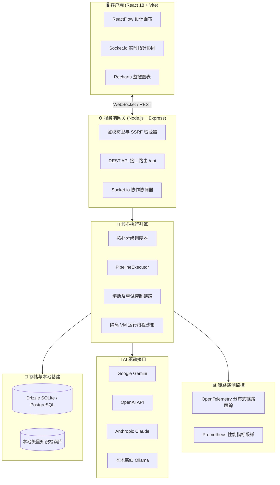

<div align="center">


# 🌌 AgentForge44

### 用于高弹性、自我纠正多智能体 LLM 工作流的可视化低代码编排平台

**在画布上设计复杂推理。以高可用 API 形式发布运行。实时观测全局状态。**

<p>
  <a href="./README.md">🇺🇸 English</a> &nbsp;|&nbsp;
  <a href="./README.ru.md">🇷🇺 Русский</a> &nbsp;|&nbsp;
  <b>🇨🇳 中文</b>
</p>

<p>


</p>

</div>

---

## ✨ 项目概览

**AgentForge44** 是一款生产级、低代码的多智能体 AI 工作流设计与编排平台。它配备了全交互式矢量画布，允许开发者通过拖拽节点轻松连接 LLM 推理链、条件路由（Router）、语义知识检索器（RAG）以及自我纠正的评估环路（Reviewer），并将整套编排成果发布为高可用、高弹性的 REST API。

该平台统一集成了当前最主流的 LLM 供应商（**Google Gemini、OpenAI、Anthropic Claude 以及本地离线 Ollama**），提供鲁棒的并行执行机制、自动数据库迁移功能，并在网络安全与分布式遥测方面提供卓越的默认保障。

---

## 🗺️ 目录

- [功能特性](#-功能特性)
- [节点类型](#-节点类型)
- [系统架构](#-系统架构)
- [技术栈](#-技术栈)
- [快速启动](#-快速启动)
- [系统配置](#-系统配置)
- [API 使用说明](#-api-使用说明)
- [可观测性](#-可观测性)
- [安全防御体系](#-安全防御体系)
- [测试套件](#-测试套件)
- [生产部署](#-生产部署)
- [开源协议](#-开源协议)

---

## 🚀 功能特性

| 功能模块 | 功能描述 |
|---|---|
| 🎨 **可视化画布** | 拖拽式节点编辑器（ReactFlow），支持一键对齐网格（Snap-to-Grid）。 |
| 🤖 **多厂商 LLM 集成** | 统一的 SDK 接口，支持 Gemini、OpenAI、Claude 及离线 Ollama。 |
| 🔄 **自我纠正闭环** | 评审节点（Reviewer）实时评估大模型输出，并在质量未达标时自动触发流程回退与迭代重试。 |
| 🗃️ **多态数据库适配** | 动态切换 SQLite（本地调试）与 PostgreSQL（生产级高并发）。 |
| ⚡ **并行拓扑执行** | 业界领先的高性能拓扑调度算法，最大化降低独立分支的串行网络延时。 |
| 📦 **无感数据自愈** | Drizzle ORM 事务级迁移器在冷启动时静默检查并修复表结构，无需手动执行 SQL。 |
| 🛡️ **企业级安全屏障** | 内置 SSRF 防御模块、基于 PBKDF2-SHA512 的安全密码哈希以及敏感秘钥的 AES-256-GCM 掩码保护。 |
| 🔌 **双重容灾自愈** | 指数级退避与抖动重试机制，配合状态熔断器（Circuit Breaker）防止故障通道级联崩溃。 |
| 📊 **三维 RAG 可视化** | 在全三维交互式空间中直观映射、检索知识切片与语义相似度关联权重。 |
| 📚 **RAG 索引与预览器** | 高级文档分块器与交互式多文档视觉目录，支持深度文本搜索与块高亮预览。 |
| 👥 **实时协同Presence** | 借助 Socket.io 实现多用户光标跟随、状态实时同步以及表单配置锁。 |
| 🔍 **分布式链路遥测** | 深度集成 OpenTelemetry 分布式跟踪与 Prometheus 原生指标监控。 |
| 🕑 **时间旅行调试器** | Git 式图表版本快照，支持交互式 Diff 差异比对与一键状态回滚。 |

---

## 🧩 节点类型

| 节点名称 | 核心用途与描述 |
|---|---|
| `Input` | 流程的入口，用于接收和收集运行时的初始输入参数。 |
| `Prompt` | 使用 Handlebars 模板语法，结合变量设计定制化 Prompt 模板。 |
| `LLM Engine` | 向指定大语言模型发起推理请求，支持调节温度、最大 Token 与系统提示。 |
| `Reviewer` | 对上游生成的文本进行判定审查，并在条件未满足时发出信号将工作流回退纠错。 |
| `Router` | 根据正则匹配或自定义脚本评估结果，将执行分支导航到对应输出。 |
| `RAG / Knowledge` | 封装本地知识库矢量检索器，完成知识切片的高精度相似度查找。 |
| `Tool / Code` | 在完全隔离的轻量化 VM 线程沙箱内，安全地执行用户提供的自定义 JavaScript 脚本。 |
| `Output` | 汇总整理拓扑图运行结果，构造最终向 API 客户端返回的结构化负载。 |

---

## 🏗️ 系统架构



---

## 🛠️ 技术栈

- **前端**: React 18+, Vite, Tailwind CSS, Framer Motion, ReactFlow, Lucide Icons, Recharts
- **后端**: Node.js, Express, TSX, Winston, Socket.io
- **数据库**: Drizzle ORM, SQLite, PostgreSQL
- **AI 框架集成**: `@google/genai`, `openai`, `@anthropic-ai/sdk`, `ollama`
- **可观测性支持**: OpenTelemetry SDK + Tracing API, `prom-client` (Prometheus)
- **安全加固**: PBKDF2-SHA512 密码哈希, AES-256-GCM 存储加密, SSRF 本地环回阻断模块

---

## ⚡ 快速启动

### 🐳 模式 A: 使用 Docker Compose 一键运行（推荐）
确保您的系统已经正确安装了 Docker 和 Docker Compose：
```bash
# 1. 克隆代码仓库
git clone https://github.com/igraybalalayka/AgentForge44.git
cd AgentForge44

# 2. 一键拉起多容器生产开发环境
docker-compose up --build
```
打开浏览器并访问 **[http://localhost:3000](http://localhost:3000)** 即可开始。

### 🖥️ 模式 B: 本地手工启动
请确保本地已配置好 **Node.js v18** 或更高版本的开发环境：
```bash
# 1. 自动拉取依赖包
npm install

# 2. 初始化环境配置文件
cp .env.example .env

# 为服务器底层安全生成必须的加密秘钥
echo "JWT_SECRET=$(openssl rand -base64 48)" >> .env
echo "ENCRYPTION_MASTER_KEY=$(openssl rand -base64 48)" >> .env

# 3. 启动全栈联动开发服务器
npm run dev
```
在浏览器中打开：**[http://localhost:3000](http://localhost:3000)**。

> 💡 **演示演示沙箱模式（Showcase Mode）:** 将 `GEMINI_API_KEY` 设置为 `sandbox_free_test_gemini` 后，系统将处于沙箱高保真演示状态，流程画布中的 LLM 节点会模拟各种精准的应答响应，无需花费个人账户余额。

---

## ⚙️ 系统配置

核心环境变量列表（详见 [`.env.example`](./.env.example)）：

| 环境变量名 | 是否必填 | 功能与作用描述 |
|---|:---:|---|
| `JWT_SECRET` | 是 | 用于签发 JWT 用户鉴权令牌的安全密钥（长度需大于 32 字符）。 |
| `ENCRYPTION_MASTER_KEY`| 是 | AES-256-GCM 对称算法所需的存储层秘钥，用来加密第三方 API 秘钥。 |
| `GEMINI_API_KEY` | 否 | 谷歌 AI Studio 的访问授权密匙（或 `sandbox_free_test_gemini`）。 |
| `DB_TYPE` | 否 | 物理数据库引擎类型：`sqlite`（默认值）或 `postgres`。 |
| `DATABASE_URL` | 否 | PostgreSQL 连接串信息（仅在 DB_TYPE 设定为 postgres 时生效）。 |
| `SENTRY_DSN` | 否 | Sentry 系统的 DSN，用于异常日志上报及追踪系统崩溃。 |

---

## 🔌 API 使用说明

完整的 Swagger OpenAPI 3.0 文档发布在：**`GET /api-docs`**。

### 1. 创建或更新工作流模型（`POST /api/graphs`）
```bash
curl -X POST http://localhost:3000/api/graphs \
  -H "Content-Type: application/json" \
  -H "Authorization: Bearer <JWT_TOKEN>" \
  -d '{
    "id": "translation-validator",
    "name": "Localization Evaluator",
    "nodes": [
      {
        "id": "prompt-input",
        "type": "prompt",
        "fields": { "text": "Translate and polish: {{input_text}}" }
      }
    ],
    "connections": []
  }'
```

### 2. 触发或调度工作流执行（`POST /api/execute`）
```bash
curl -X POST http://localhost:3000/api/execute \
  -H "Content-Type: application/json" \
  -d '{
    "graphId": "translation-validator",
    "inputs": {
      "input_text": "Good morning, developers!"
    }
  }'
```

---

## 📊 可观测性

- **Prometheus 指标流**: 提供符合标准协议规范的 `GET /metrics` 端点，采集请求成功率、路由延迟分位数、LLM 调用总频次及 Token 实际消耗量。
- **分布式 Trace 链路追踪**: 全链路上下文跟踪，方便将流程中大模型计算的耗时瓶颈和 Drizzle 操作记录直接导出并在 Zipkin 或 Jaeger 中可视化。
- **优雅停机 (Graceful Shutdown)**: 核心组件正确响应 `SIGTERM` 和 `SIGINT` 终止信号，安全持久化最后一次 Trace span 并完成数据库线程池的安全归还。

---

## 🛡️ 安全防御体系

1. **SSRF 全域防护**: 严格的前置校验，严禁外部流程中包含的请求探测本地环回或局域网物理拓扑（`127.0.0.1`、`10.0.0.0/8`、`192.168.0.0/16` 等）。
2. **敏感日志清洗**: 针对任何控制台流转日志执行递归过滤，确保包含 `api_key`、`password` 或 `jwt_token` 等敏感信息的字段被自动脱敏遮罩。
3. **ReDoS 性能卫士**: 严格限制条件导航中包含的正则表达式复杂度，杜绝恶意构造的正则表达式引发灾难性回溯导致服务器停机崩溃。
4. **代码沙箱沙盒**: 智能体中引入的自定义 `Tool` JavaScript 逻辑，在完全隔离的轻量化后台 Worker 进程中受限加载，杜绝获取宿主机磁盘、进程权限。

---

## 🧪 测试套件

```bash
npm run test           # 运行 Vitest 单元与集成测试
npm run test:coverage  # 生成单元测试覆盖率报表
npm run test:e2e       # 拉起 Playwright 全流程端到端自动化测试
npm run lint           # 执行 ESLint 静态代码及类型检验
```

---

## 📜 开源协议

本项目基于 **MIT 协议** 授权发布。详情请查看 [LICENSE](./LICENSE) 文件。

<div align="center">

**用 ❤️ 为高弹性的可视化 AI 社区倾心打造。**

</div>
