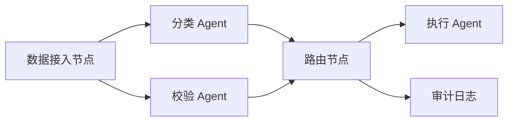
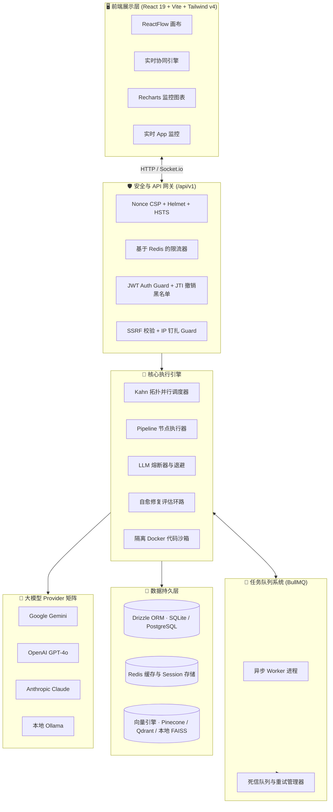

<div align="center">


# 🌌 KostromAi44

### **企业级弹性自愈多智能体 (Multi-Agent) AI 网络可视化 Low-Code 编排与执行引擎**

**几分钟内将具备自愈能力的自治 Multi-Agent AI 工作流一键部署为高扩展 REST 及 WebSocket API — 集成加固型 Docker 代码沙箱、DAG 拓扑调度与实时多人协同设计。**

[](#-快速开始)
[](#-企业级安全与合规)
[](https://www.typescriptlang.org/)
[](https://react.dev/)
[](LICENSE)

---

🌐 **多语言:** &nbsp; [**English**](README.md) &nbsp;|&nbsp; [**Русский**](README.ru.md) &nbsp;|&nbsp; [**简体中文**](README.zh.md)

---

[**🎯 在线 Demo**](https://kostromai44.app) &nbsp;•&nbsp; [**📚 官方文档**](https://docs.kostromai44.app) &nbsp;•&nbsp; [**💬 Discord 社区**](https://discord.gg/kostromai44) &nbsp;•&nbsp; [**🎥 2分钟视频演示**](https://youtu.be/demo)

</div>

---

## 📋 目录

- [🌌 平台概述](#-平台概述)
- [🎯 为什么选择 KostromAi44？](#-为什么选择-kostromai44)
- [💡 应用场景与构建案例](#-应用场景与构建案例)
- [⚡ 核心架构与特性](#-核心架构与特性)
- [🏗️ 系统总体架构图](#️-系统总体架构图)
- [📊 KostromAi44 与同类产品对比](#-kostromai44-与同类产品对比)
- [🚀 快速开始](#-快速开始)
  - [方案一：Docker Compose（推荐）](#方案一docker-compose推荐)
  - [方案二：本地开发环境](#方案二本地开发环境)
- [⚙️ 环境变量说明](#️-环境变量说明)
- [🔌 API 接口指南](#-api-接口指南)
- [🔒 企业级安全与合规](#-企业级安全与合规)
- [🧪 代码质量、测试与 CI/CD](#-代码质量测试与-cicd)
- [🗺️ 产品路线图](#️-产品路线图)
- [🤝 贡献与社区](#-贡献与社区)
- [💼 商业支持与联系](#-商业支持与联系)
- [📄 开源协议](#-开源协议)

---

## 🌌 平台概述

**KostromAi44** 是一款开源企业级可视化 AI 编排引擎与生产运行环境，旨在帮助开发者轻松构建、测试、调试和运行复杂的自主多智能体 (Multi-Agent) 拓扑网络。平台基于 Kahn 拓扑调度算法、Promise 连接池并发控制、Docker 加固代码沙箱以及 Socket.io 实时多人协同构建，完美融合了拖拽式 Low-Code 工作流的便捷性与生产级后端架构的严谨性。

无论您是要部署智能客服 Agent、代码审查 Bot、复杂 RAG 知识库引擎还是自动化数据流，KostromAi44 都能帮助您在一键之间将可视化 DAG 矢量图转化为安全的 REST/WebSocket 微服务。

---

## 🎯 为什么选择 KostromAi44？

| AI 工程化挑战 | 传统解决方案 | KostromAi44 解决方案 |
| :--- | :--- | :--- |
| **LLM 编排复杂度** | **无代码工具** (Zapier, Make)：刚性强，难以支持复杂 LLM 分支、状态管理与自定义代码。 | **可视化 DAG 画布 + 完整代码自由**：支持自定义 JS/Python 节点并在隔离容器中运行。 |
| **后端开发与维护成本** | **代码框架** (LangChain, CrewAI)：需要数周编写后端逻辑、队列、重试及监控代码。 | **一键部署 API**：将可视化工作流即时转化为带版本控制的 `/api/v1` REST 及 WebSocket 端点。 |
| **厂商锁定与高昂费用** | **SaaS 平台** (Relevance AI, Flowise SaaS)：每月 $500+，闭源托管，存在数据隐私风险。 | **100% 开源与自主托管**：采用 MIT 协议，完全掌控数据，支持私有云或本地 On-Premise 部署。 |
| **不可信代码执行风险** | **原生直接执行**：易遭受死循环、远程代码执行 (RCE) 及文件系统泄露攻击。 | **加固 Docker 沙箱**：非 Root 容器、严格内存限制、只读文件系统与 Capabilities 剥离。 |

---

## 💡 应用场景与构建案例

| 业务场景 | 拓扑链路流程 | 部署上线时间 |
| :--- | :--- | :---: |
| 🤖 **自主智能客服 Agent** | 邮件接收 → 意图分类 → 知识库检索 (RAG) → 人工审批确认 → 自动回复 | ~2 小时 |
| 📊 **Multi-Agent 深度调研** | 查询规划 → 并行网络搜索 → 交叉验证 → Markdown 摘要生成 → 报告 | ~3 小时 |
| 💻 **自动代码与 PR 审查 Bot** | GitHub Webhook → Git Diff 分析 → 安全审计 → 规范检查 → 自动提交 Comment | ~4 小时 |
| 📚 **企业级混合 RAG 系统** | 文档切块 → 多模态向量化 → 向量数据库 (Pinecone/Qdrant) → 混合重排检索 | ~3 小时 |
| 🛒 **电商智能导购 Agent** | 自然语言提问 → 实时库存查询 → 个性化推荐 → Stripe API 结算 | ~5 小时 |

---

## ⚡ 核心架构与特性

### 🧠 **拓扑并行 DAG 调度器**
基于 Kahn 算法与 Promise 异步连接池，KostromAi44 可在保证执行顺序的前提下无死锁地并行执行独立工作流分支，确保极高的处理吞吐量与极低延迟。


```mermaid
graph LR
    A[数据接入节点] --> B[分类 Agent]
    A --> C[校验 Agent]
    B --> D[路由节点]
    C --> D
    D --> E[执行 Agent]
    D --> F[审计日志]
```

### 🛡️ **加固型 Docker 代码沙箱**
代码执行节点运行在专用的临时 Docker 容器内，具备多层安全防护：
- `--cap-drop ALL` — 彻底剥离 Linux 内核特权。
- `--network none` — 默认隔离外部网络访问（除非显式配置路由）。
- `--read-only` — 根文件系统绝对只读。
- `64 MB RAM` — 严格配额管理。
- `5s Timeout` — 自动终止失控脚本。

### 🔄 **透明自愈与弹性重试**
针对大模型 API 限流或临时网络波动，系统内置自愈机制：
1. **指数退避重试**：带随机抖动的自动重试机制。
2. **Provider 热切换**：无缝降级（例如：OpenAI → Anthropic Claude → Google Gemini → 本地 Ollama）。
3. **真实遥测标记**：自动打上 `completed_with_warning` 状态，杜绝隐式静默失败。

### 👥 **实时多人协同设计**
基于 Socket.io 构建并实现房间隔离：
- 实时光标追踪与带颜色标识的用户头像。
- 乐观节点锁，防止多人同时编辑冲突。
- 协同冲突解决界面，大幅提升团队研发效率。

### 🕑 **时光倒流 (Time-Travel) 调试器**
工作流图谱中的每次状态变更均会生成不可变快照。支持前后自由穿梭、对比节点输入输出，从任意历史快照点重新播放执行。

---

## 🏗️ 系统总体架构图


```mermaid
flowchart TD
    subgraph Client["🖥️ 前端展示层 (React 19 + Vite + Tailwind v4)"]
        Canvas[ReactFlow 画布]
        Presence[实时协同引擎]
        Analytics[Recharts 监控图表]
        Monitor[实时 App 监控]
    end

    subgraph Gateway["🛡️ 安全与 API 网关 (/api/v1)"]
        CSP[Nonce CSP + Helmet + HSTS]
        RL[基于 Redis 的限流器]
        Auth[JWT Auth Guard + JTI 撤销黑名单]
        SSRF[SSRF 校验 + IP 钉扎 Guard]
    end

    subgraph Engine["🧠 核心执行引擎"]
        Scheduler[Kahn 拓扑并行调度器]
        Executor[Pipeline 节点执行器]
        Breaker[LLM 熔断器与退避]
        Healing[自愈修复评估环路]
        Sandbox[隔离 Docker 代码沙箱]
    end

    subgraph Queue["📮 任务队列系统 (BullMQ)"]
        Workers[异步 Worker 进程]
        DLQ[死信队列与重试管理器]
    end

    subgraph Storage["💾 数据持久层"]
        DB[(Drizzle ORM · SQLite / PostgreSQL)]
        Cache[(Redis 缓存与 Session 存储)]
        Vector[(向量引擎 · Pinecone / Qdrant / 本地 FAISS)]
    end

    subgraph LLMs["🤖 大模型 Provider 矩阵"]
        Gemini[Google Gemini]
        OpenAI[OpenAI GPT-4o]
        Claude[Anthropic Claude]
        Ollama[本地 Ollama]
    end

    Client <-->|HTTP / Socket.io| Gateway
    Gateway --> Engine
    Engine <--> Queue
    Queue --> DLQ
    Engine --> Storage
    Engine --> LLMs
```

---

## 📊 KostromAi44 与同类产品对比

| 功能特性 | KostromAi44 | LangChain | CrewAI | Relevance AI | Flowise |
| :--- | :---: | :---: | :---: | :---: | :---: |
| **交互式矢量画布** | ✅ | ❌ | ❌ | ✅ | ✅ |
| **一键生成 REST/WS API** | ✅ | ⚠️ 需手动 | ⚠️ 需手动 | ✅ | ⚠️ 受限 |
| **Docker 代码沙箱隔离** | ✅ | ❌ | ❌ | ✅ | ❌ |
| **自愈修复与降级兜底** | ✅ | ❌ | ❌ | ⚠️ 基础 | ❌ |
| **实时多人协同设计** | ✅ | ❌ | ❌ | ❌ | ❌ |
| **时光倒流快照回放** | ✅ | ❌ | ❌ | ❌ | ❌ |
| **Multi-LLM 运行时热切** | ✅ | ✅ | ✅ | ✅ | ✅ |
| **开源协议 (MIT)** | ✅ | ✅ | ✅ | ❌ | ✅ |
| **100% 支持私有化部署** | ✅ | ✅ | ✅ | ❌ | ✅ |

---

## 🚀 快速开始

### 方案一：Docker Compose（推荐）

在 60 秒内启动完整生产级服务栈：

```bash
# 1. 克隆代码仓库
git clone https://github.com/ppiiyo/AgentForge44.git kostromai44
cd kostromai44

# 2. 启动 Docker 容器栈
docker compose up -d --build

# 3. 在浏览器中访问 http://localhost:3000
```

*服务栈包含：* Nginx 反向代理 → Express API 网关 → Node.js 后端 → PostgreSQL → Redis → Docker 沙箱 Runner。

---

### 方案二：本地开发环境

环境要求：**Node.js ≥ 22.0.0**，**npm ≥ 10.0.0**，以及 **Docker**（可选，用于代码执行节点）。

```bash
# 1. 克隆仓库并安装依赖
git clone https://github.com/ppiiyo/AgentForge44.git kostromai44
cd kostromai44
npm install

# 2. 配置环境变量
cp .env.example .env

# 生成高强度安全秘钥（至少 32 字符）
export JWT_SECRET=$(openssl rand -base64 48)
export ENCRYPTION_MASTER_KEY=$(openssl rand -base64 48)

# 3. 初始化数据库与模版数据
npm run db:push     # 推送 Schema（默认 SQLite）
npm run db:seed     # 填充内置模版市场数据

# 4. 启动开发服务器
npm run dev
```

打开浏览器访问 **`http://localhost:3000`**。系统首位注册账号将自动获得 **超级管理员 (Admin)** 权限。

---

## ⚙️ 环境变量说明

| 变量名 | 类型 | 默认值 | 描述说明 |
| :--- | :---: | :---: | :--- |
| `PORT` | `number` | `3000` | 应用 HTTP 服务端口 |
| `NODE_ENV` | `string` | `development` | 运行环境（`development`, `production`, `test`） |
| `JWT_SECRET` | `string` | *必填* | JWT 签名秘钥（至少 32 字符） |
| `ENCRYPTION_MASTER_KEY` | `string` | *必填* | 数据库 API 密钥 AES-256-GCM 主加密密钥 |
| `DB_TYPE` | `string` | `sqlite` | 数据库适配器类型（`sqlite` 或 `postgres`） |
| `DATABASE_URL` | `string` | — | PostgreSQL 数据库连接字符串 |
| `REDIS_URL` | `string` | — | BullMQ 队列及缓存 Redis 连接地址 |
| `GEMINI_API_KEY` | `string` | — | Google AI Studio Gemini API Key |
| `OPENAI_API_KEY` | `string` | — | OpenAI API Key |
| `ANTHROPIC_API_KEY` | `string` | — | Anthropic Claude API Key |
| `OLLAMA_HOST` | `string` | `http://localhost:11434` | 本地 Ollama 服务地址 |

---

## 🔌 API 接口指南

所有 API 端点均支持统一的版本前缀 **`/api/v1`**（同时向前兼容 **`/api`** 前缀）。

| 请求方式 | 路由地址 | 功能说明 | 是否需要鉴权 |
| :--- | :--- | :--- | :---: |
| `POST` | `/api/v1/auth/register` | 用户注册（首位注册用户自动为 Admin） | 否 |
| `POST` | `/api/v1/auth/login` | 用户登录并获取 JWT Token | 否 |
| `POST` | `/api/v1/auth/logout` | 注销登录并将 JWT 加入 Redis JTI 黑名单 | 是 |
| `POST` | `/api/v1/execute/graph` | 同步执行原始 DAG 图节点与连接 | 是 |
| `POST` | `/api/v1/execute/blueprint` | 根据 Blueprint ID 执行预设工作流 | 是 |
| `POST` | `/api/v1/runs` | 提交异步后台运行任务 | 是 |
| `GET` | `/api/v1/runs/:id` | 查询任务执行状态、日志与输出状态 | 是 |
| `GET` | `/api/v1/health` | 系统组件健康状态检查端点 | 否 |
| `GET` | `/metrics` | Prometheus 监控指标采集端点 | 是 |

可直接访问 **`/api-docs`** 体验交互式 Swagger OpenAPI 文档。

---

## 🔒 企业级安全与合规

KostromAi44 具备安全优先的企业级架构：

- **网络防护**：基于 Nonce 的 Content Security Policy (CSP)、防 SSRF 的 IP 钉扎机制、强制 HSTS。
- **身份认证**：JWT Token 结合 Redis `jti` 黑名单实时撤销；细粒度 RBAC 权限控制。
- **数据安全**：数据库敏感 API Key 采用 AES-256-GCM 静态加密；传输层全程 TLS 1.3。
- **沙箱隔离**：使用独立的非 Root 权限 Docker 容器运行不可信的用户代码。
- **审计追溯**：每个工作流运行与节点输出快照均保留不可变的日志审计链。

---

## 🧪 代码质量、测试与 CI/CD

```bash
# 运行单元测试与集成测试 (Vitest)
npm test

# 检查测试覆盖率 (行覆盖率 ≥ 70%, 函数 ≥ 70%, 分支 ≥ 60%)
npm run test:coverage

# 执行 Playwright 端到端 (E2E) 浏览器测试
npm run test:e2e

# 运行 k6 压测与性能测试
npm run test:load

# 严格 TypeScript 类型检查与 ESLint 校验
npm run lint
```

---

## 🗺️ 产品路线图

### 🟢 2026 Q4 (已完成)
- [x] Kahn 拓扑 DAG 并行调度器（含 Promise 连接池）。
- [x] 加固型 Docker 代码执行沙箱。
- [x] Socket.io 实时多人协同。
- [x] 多大模型 Provider 支持 (Gemini, OpenAI, Claude, Ollama)。
- [x] 生产级 Docker Compose 容器化部署。

### 🟡 2027 Q1 (进行中)
- [ ] 社区工作流模版市场 (Marketplace)。
- [ ] Kubernetes Helm Chart 与 Operator 部署包。
- [ ] 企业级 SSO (SAML 2.0 / OIDC) 单点登录。

### 🔵 2027 Q2 (规划中)
- [ ] 可视化单步断点调试器 (Breakpoint Debugger)。
- [ ] 实时 Token 消耗与成本分析。
- [ ] 多租户工作空间数据隔离边界。

---

## 🤝 贡献与社区

我们热忱欢迎开发者、研究人员及 AI 爱好者参与项目贡献！

1. 在 GitHub 上 Fork 本仓库。
2. 创建您的 Feature 分支 (`git checkout -b feature/amazing-feature`)。
3. 确保通过所有测试与 Linter 检查 (`npm run lint && npm test`)。
4. 提交您的修改 (`git commit -m 'feat: Add amazing feature'`)。
5. 推送到分支 (`git push origin feature/amazing-feature`)。
6. 提交 Pull Request。

详情请参阅 [`CONTRIBUTING.md`](CONTRIBUTING.md)。

---

## 💼 商业支持与联系

需要企业级部署协助、定制化开发或 SLA 商业支持？

- **官方网站**: [https://kostromai44.app](https://kostromai44.app)
- **联系邮箱**: [prodazzha44@gmail.com](mailto:prodazzha44@gmail.com)
- **Discord 社区**: [加入 KostromAi44 Discord 服务器](https://discord.gg/kostromai44)

---

## 📄 开源协议

本项目采用 **[MIT 开源协议](LICENSE)**。

---

<div align="center">

**由 KostromAi44 研发团队精心打造 ❤️**

[**返回顶部 ⬆️**](#-kostromai44)

</div>
